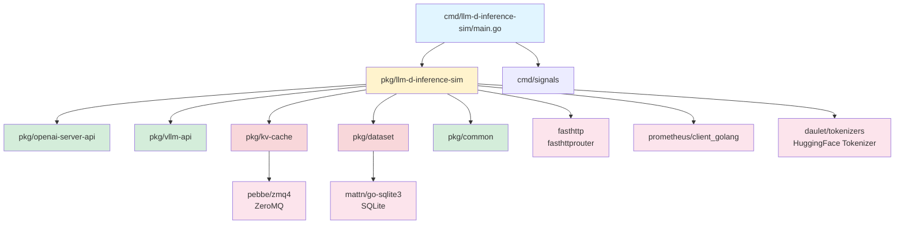

# 项目概览

## 一、项目简介

**llm-d-inference-sim** 是一个用 Go 编写的 vLLM HTTP 端点模拟器，**不执行真实推理**，而是通过模拟延迟和响应来模拟 vLLM 服务器行为。主要用于测试、开发和性能基准测试场景。

### 核心功能

- **OpenAI 兼容 API**：`/v1/chat/completions`、`/v1/completions`、`/v1/models`
- **vLLM 专用端点**：`/v1/load_lora_adapter`、`/v1/unload_lora_adapter`、`/tokenize`
- **监控端点**：`/metrics`（Prometheus）、`/health`、`/ready`
- **响应模式**：
  - `echo`：返回请求中的相同文本
  - `random`：返回预定义的随机句子
- **延迟控制**：
  - Time-to-First-Token (TTFT)
  - Inter-Token Latency
  - KV Cache Transfer Latency

---

## 二、目录结构与职责

| 目录 / 包                       | 主要职责                                      | 关键文件                                                                 |
|--------------------------------|---------------------------------------------|-------------------------------------------------------------------------|
| **`cmd/llm-d-inference-sim/`** | 程序入口，初始化日志、信号处理、启动模拟器      | `main.go`                                                               |
| **`cmd/signals/`**             | 优雅关闭的信号处理（SIGTERM、SIGINT）          | `signal.go`                                                             |
| **`pkg/llm-d-inference-sim/`** | 核心模拟器实现                                 | `server.go`（HTTP 路由）<br>`simulator.go`（请求处理）<br>`streaming.go`（SSE 流式）<br>`latencies.go`（延迟模拟）<br>`lora.go`（LoRA 适配器管理）<br>`metrics.go`（Prometheus 指标）<br>`failures.go`（故障注入）<br>`server_tls.go`（TLS 支持） |
| **`pkg/openai-server-api/`**   | OpenAI API 的请求/响应结构和工具验证            | `request.go`<br>`response.go`<br>`tools_utils.go`                      |
| **`pkg/vllm-api/`**            | vLLM 专用 API 结构（分词、模型列表）            | `tokenize.go`<br>`models.go`                                            |
| **`pkg/kv-cache/`**            | KV 缓存模拟和 ZMQ 事件发布                     | `kv_cache.go`<br>`block_cache.go`<br>`kv_cache_sender.go`              |
| **`pkg/dataset/`**             | 基于 SQLite 的数据集，用于从对话历史生成响应    | `dataset.go`                                                            |
| **`pkg/common/`**              | 共享工具（配置、工具函数）                      | `config.go`<br>`utils.go`                                               |
| **`manifests/`**               | 配置示例文件                                   | `config.yaml`                                                           |
| **`helm/`**                    | Helm Chart 部署文件                           | `llm-d-inference-sim/`                                                  |
| **`hooks/`**                   | Git Hooks 脚本                                | `pre-commit`                                                            |

---

## 三、构建与运行方式

### 3.1 本地构建（Native）

```bash
# 安装依赖
make download-zmq        # 安装 ZeroMQ（KV 缓存模拟必需）
make download-tokenizer  # 下载 HuggingFace tokenizer 绑定

# 编译二进制
make build               # 生成 bin/llm-d-inference-sim

# 运行
./bin/llm-d-inference-sim --model "Qwen/Qwen2.5-1.5B-Instruct" --port 8000

# 使用配置文件
./bin/llm-d-inference-sim --config manifests/config.yaml
```

### 3.2 Docker 构建

```bash
# 构建镜像（默认标签：ghcr.io/llm-d/llm-d-inference-sim:dev）
make image-build

# macOS 上需指定 TARGETOS
make image-build TARGETOS=linux

# 运行容器
docker run --rm --publish 8000:8000 \
  ghcr.io/llm-d/llm-d-inference-sim:dev \
  --port 8000 --model "Qwen/Qwen2.5-1.5B-Instruct"

# 推送镜像
make image-push
```

### 3.3 Helm 部署

```bash
# 安装
make install-helm

# 卸载
make uninstall-helm
```

### 3.4 测试与代码质量

```bash
# 运行所有测试
make test

# 运行特定测试（使用 Ginkgo Focus）
make test GINKGO_FOCUS="should handle chat completions"

# 格式化代码
make format

# 运行 linter
make lint
```

---

## 四、外部依赖

### 4.1 核心框架与库

| 依赖                          | 用途                                      | 类型               |
|------------------------------|-------------------------------------------|--------------------|
| **fasthttp**                 | 高性能 HTTP 服务器                         | Go 库              |
| **fasthttprouter**           | HTTP 路由                                 | Go 库              |
| **klog/v2**                  | Kubernetes 风格日志                        | Go 库              |
| **prometheus/client_golang** | Prometheus 指标暴露                        | Go 库              |
| **spf13/pflag**              | 命令行标志解析                             | Go 库              |

### 4.2 CGO 依赖（需要 C 库）

| 依赖                  | 用途                                      | 安装方式                          |
|----------------------|-------------------------------------------|----------------------------------|
| **daulet/tokenizers** | HuggingFace tokenizer 绑定（`libtokenizers.a`） | `make download-tokenizer`        |
| **pebbe/zmq4**        | ZeroMQ 绑定（KV 缓存事件发布）              | `make download-zmq`（需 `libzmq3-dev`） |
| **mattn/go-sqlite3**  | SQLite 数据库（数据集支持）                | 自动编译                          |

### 4.3 测试框架

| 依赖                  | 用途                                      |
|----------------------|-------------------------------------------|
| **Ginkgo/Gomega**     | BDD 风格测试框架                           |

### 4.4 可选依赖

- **Docker/Podman**：容器化运行
- **Helm**：Kubernetes 部署
- **golangci-lint**：代码检查（配置文件：`.golangci.yml`）

---

## 五、配置方式

支持三种配置方式（优先级从高到低）：

1. **命令行标志**（使用 `pflag` 解析）
   ```bash
   --model "Qwen/Qwen2.5-1.5B-Instruct" --port 8000 --data-parallel-size 4
   ```

2. **YAML 配置文件**
   ```bash
   --config manifests/config.yaml
   ```

3. **环境变量**
   - `POD_NAME`
   - `POD_NAMESPACE`

---

## 六、特性说明

### 6.1 Data Parallel 支持

通过 `--data-parallel-size` 参数（1-8）启动多个 Rank：

- **Rank 0**：运行在指定的 `--port`
- **Rank 1-N**：依次运行在 `port+1`、`port+2` 等

示例：
```bash
./bin/llm-d-inference-sim --port 8000 --data-parallel-size 3
# Rank 0: 8000, Rank 1: 8001, Rank 2: 8002
```

### 6.2 TLS 支持

通过配置文件启用 TLS（参见 `pkg/llm-d-inference-sim/server_tls.go`）。

### 6.3 故障注入

支持模拟各种故障场景（参见 `pkg/llm-d-inference-sim/failures.go`）。

---

## 七、新手阅读顺序建议

### 阶段一：理解整体流程（由外向内）

1. **`cmd/llm-d-inference-sim/main.go`**
   了解程序入口、日志初始化、信号处理、模拟器启动流程。

2. **`pkg/llm-d-inference-sim/server.go`**
   HTTP 服务器设置、路由定义（`fasthttprouter`）、端点映射。

3. **`pkg/llm-d-inference-sim/simulator.go`**
   请求处理核心逻辑、响应生成（echo/random 模式）、流式/非流式响应分发。

### 阶段二：深入核心功能

4. **`pkg/llm-d-inference-sim/streaming.go`**
   SSE（Server-Sent Events）流式响应实现。

5. **`pkg/llm-d-inference-sim/latencies.go`**
   延迟模拟逻辑（TTFT、Inter-Token、KV Cache Transfer）。

6. **`pkg/openai-server-api/request.go` 和 `response.go`**
   OpenAI API 的请求/响应数据结构。

7. **`pkg/vllm-api/tokenize.go` 和 `models.go`**
   vLLM 专用端点的 API 结构。

### 阶段三：高级特性

8. **`pkg/llm-d-inference-sim/lora.go`**
   LoRA 适配器加载/卸载管理。

9. **`pkg/llm-d-inference-sim/metrics.go`**
   Prometheus 指标暴露（请求计数、延迟直方图等）。

10. **`pkg/kv-cache/kv_cache.go`**
    KV 缓存模拟和 ZMQ 事件发布机制。

11. **`pkg/dataset/dataset.go`**
    SQLite 数据集支持，从对话历史生成响应。

12. **`pkg/llm-d-inference-sim/failures.go`**
    故障注入逻辑。

### 阶段四：测试与配置

13. **测试文件（`*_test.go`）**
    以 `pkg/llm-d-inference-sim/simulator_test.go` 为例，学习 Ginkgo 测试风格。

14. **`pkg/common/config.go`**
    配置解析和管理。

15. **`manifests/config.yaml`**
    配置示例。

---

## 八、常见操作速查

| 操作                  | 命令                                      |
|----------------------|-------------------------------------------|
| 安装所有依赖          | `make download-zmq && make download-tokenizer` |
| 本地编译              | `make build`                              |
| 运行测试              | `make test`                               |
| 运行特定测试          | `make test GINKGO_FOCUS="your focus"`     |
| 格式化代码            | `make format`                             |
| 代码检查              | `make lint`                               |
| 构建 Docker 镜像      | `make image-build`                        |
| 推送镜像              | `make image-push`                         |
| 运行二进制            | `./bin/llm-d-inference-sim --model <model> --port <port>` |
| 使用配置文件          | `./bin/llm-d-inference-sim --config manifests/config.yaml` |
| 安装 Git Hooks        | `make install-hooks`                      |

---

## 九、关键调用链（伪代码）

```
main.go
  ├─ vllmsim.New(logger)  → 创建模拟器实例
  │   ├─ 解析配置（命令行标志 / YAML）
  │   ├─ 初始化 KV 缓存（如果启用）
  │   ├─ 加载 Tokenizer（如果指定）
  │   └─ 设置 Prometheus 指标
  │
  └─ vllmSim.Start(ctx)  → 启动 HTTP 服务器
      ├─ setupRouter()  → 注册路由（fasthttprouter）
      │   ├─ /v1/chat/completions → handleChatCompletions()
      │   ├─ /v1/completions → handleCompletions()
      │   ├─ /v1/models → handleModels()
      │   ├─ /metrics → promhttp.Handler()
      │   └─ ...
      │
      ├─ 启动 Data Parallel Ranks（如果 > 1）
      └─ fasthttp.ListenAndServe()
          │
          └─ 请求处理流程（以 /v1/chat/completions 为例）
              ├─ 解析请求体（JSON → ChatCompletionRequest）
              ├─ 验证工具调用（validateTools）
              ├─ 生成响应内容（echo / random / dataset）
              ├─ 模拟延迟（TTFT、Inter-Token）
              ├─ 流式输出（SSE）或返回完整响应
              └─ 更新 Prometheus 指标
```

---

## 十、Mermaid 模块依赖图



**图例说明**：
- **蓝色**：程序入口
- **黄色**：核心模拟器
- **绿色**：内部包
- **红色**：CGO 依赖包
- **粉色**：外部框架/库

---

## 十一、项目元信息

- **许可证**：Apache License 2.0
- **主分支**：`main`
- **容器镜像**：`ghcr.io/llm-d/llm-d-inference-sim`
- **默认标签**：`dev`
- **Go 版本**：1.24.1+
- **CGO 必需**：是（Tokenizer、ZMQ、SQLite）

---

## 十二、参考资源

- **项目 README**：`/workspaces/llm-d-inference-sim/README.md`
- **配置示例**：`/workspaces/llm-d-inference-sim/manifests/config.yaml`
- **Makefile**：`/workspaces/llm-d-inference-sim/Makefile`
- **Golangci-lint 配置**：`/workspaces/llm-d-inference-sim/.golangci.yml`
- **ZMQ 官方文档**：https://zeromq.org/
- **HuggingFace Tokenizers**：https://github.com/daulet/tokenizers
