# 程序入口与启动流程

## 一、程序入口点

### 主入口文件

| 文件路径 | 入口函数 | 说明 |
|---------|---------|------|
| `cmd/llm-d-inference-sim/main.go` | `func main()` | 程序唯一入口，负责初始化日志、信号处理、创建并启动模拟器 |

### 入口函数代码概览

```go
// cmd/llm-d-inference-sim/main.go:30-46
func main() {
    // 1. 设置日志器和上下文
    logger := klog.Background()
    ctx := klog.NewContext(context.Background(), logger)

    // 2. 设置信号处理（优雅关闭）
    ctx = signals.SetupSignalHandler(ctx)

    logger.Info("Starting vLLM simulator")

    // 3. 创建模拟器实例
    vllmSim, err := vllmsim.New(logger)
    if err != nil {
        logger.Error(err, "Failed to create vLLM simulator")
        return
    }

    // 4. 启动模拟器
    if err := vllmSim.Start(ctx); err != nil {
        logger.Error(err, "vLLM simulator failed")
    }
}
```

---

## 二、CLI 框架与命令行参数

### 使用的 CLI 框架

本项目使用 **`spf13/pflag`** 作为命令行参数解析框架（兼容 GNU 风格长短选项），结合 **`klog/v2`** 的日志标志。

### 配置加载方式

支持三种配置方式（优先级：命令行 > 配置文件 > 默认值）：

1. **命令行标志**：`--port 8000 --model "Qwen/Qwen2.5-1.5B-Instruct"`
2. **YAML 配置文件**：`--config manifests/config.yaml`
3. **环境变量**：`POD_NAME`、`POD_NAMESPACE`、`PYTHONHASHSEED`

### 关键命令行参数

| 参数 | 类型 | 默认值 | 说明 |
|-----|------|--------|------|
| `--config` | string | - | YAML 配置文件路径 |
| `--port` | int | 8000 | HTTP/HTTPS 监听端口 |
| `--model` | string | 必填 | 基础模型名称 |
| `--served-model-name` | []string | `[model]` | API 暴露的模型别名（支持多个） |
| `--mode` | string | `"random"` | 响应生成模式（`echo` / `random`） |
| `--max-num-seqs` | int | 5 | 最大并发请求数 |
| `--max-model-len` | int | 1024 | 模型上下文窗口大小 |
| `--time-to-first-token` | int | 0 | 首 token 延迟（毫秒） |
| `--inter-token-latency` | int | 0 | token 间延迟（毫秒） |
| `--enable-kvcache` | bool | false | 启用 KV 缓存模拟 |
| `--data-parallel-size` | int | 1 | Data Parallel Rank 数量（1-8） |
| `--dataset-path` | string | - | SQLite 数据集本地路径 |
| `--dataset-url` | string | - | SQLite 数据集下载 URL |
| `--failure-injection-rate` | int | 0 | 故障注入概率（0-100） |
| `--ssl-certfile` | string | - | TLS 证书文件路径 |
| `--ssl-keyfile` | string | - | TLS 私钥文件路径 |
| `--self-signed-certs` | bool | false | 自动生成自签名证书 |

**参考文件**：`pkg/common/config.go:528-659`（`ParseCommandParamsAndLoadConfig` 函数）

---

## 三、服务框架与启动逻辑

### 使用的服务框架

- **HTTP 框架**：[valyala/fasthttp](https://github.com/valyala/fasthttp)（高性能 HTTP 服务器）
- **路由框架**：[buaazp/fasthttprouter](https://github.com/buaazp/fasthttprouter)（基于 fasthttp 的路由器）
- **指标暴露**：`prometheus/client_golang`（Prometheus 集成）

### 注册的 HTTP 端点

| 方法 | 路径 | 处理函数 | 说明 |
|-----|------|---------|------|
| POST | `/v1/chat/completions` | `HandleChatCompletions` | OpenAI Chat Completion API |
| POST | `/v1/completions` | `HandleTextCompletions` | OpenAI Text Completion API |
| GET | `/v1/models` | `HandleModels` | 列出可用模型 |
| POST | `/v1/load_lora_adapter` | `HandleLoadLora` | 加载 LoRA 适配器 |
| POST | `/v1/unload_lora_adapter` | `HandleUnloadLora` | 卸载 LoRA 适配器 |
| GET | `/metrics` | Prometheus Handler | Prometheus 指标端点 |
| GET | `/health` | `HandleHealth` | Kubernetes 健康检查 |
| GET | `/ready` | `HandleReady` | Kubernetes 就绪检查 |
| POST | `/tokenize` | `HandleTokenize` | vLLM 分词端点 |

**参考文件**：`pkg/llm-d-inference-sim/server.go:45-61`（`startServer` 函数）

---

## 四、启动流程 Mermaid 图

```mermaid
flowchart TD
    Start([程序启动]) --> A[初始化 klog 日志器]
    A --> B[创建带日志的 Context]
    B --> C[设置信号处理器<br/>监听 SIGTERM/SIGINT]

    C --> D[调用 vllmsim.New<br/>创建 VllmSimulator 实例]

    D --> E{创建成功?}
    E -->|失败| Exit1[记录错误并退出]
    E -->|成功| F[调用 vllmSim.Start<br/>启动模拟器]

    F --> G[解析配置<br/>ParseCommandParamsAndLoadConfig]

    G --> G1[读取 --config 文件 YAML]
    G1 --> G2[解析命令行标志 pflag]
    G2 --> G3[合并配置<br/>命令行 > 文件 > 默认值]
    G3 --> G4[验证配置参数<br/>validate]

    G4 --> H{Data Parallel?<br/>DPSize > 1}

    H -->|是| I[启动多个 Rank<br/>端口递增]
    H -->|否| J[单 Rank 模式]

    I --> K[并发启动所有 Rank<br/>errgroup.WithContext]
    J --> K

    K --> L[startSim<br/>每个 Rank 的启动逻辑]

    L --> M[初始化 LoRA 适配器列表]
    M --> N[初始化随机种子<br/>InitRandom]
    N --> O[创建并注册 Prometheus 指标<br/>createAndRegisterPrometheus]

    O --> P[创建 HuggingFace Tokenizer<br/>NewCachedHFTokenizer]

    P --> Q{启用 KV Cache?<br/>EnableKVCache}
    Q -->|是| R[创建 KVCacheHelper<br/>启动 ZMQ 事件发布]
    Q -->|否| S[跳过 KV Cache]

    R --> T[初始化数据集<br/>initDataset]
    S --> T

    T --> T1{数据集路径存在?}
    T1 -->|是| T2[加载 SQLite 数据集<br/>CustomDataset]
    T1 -->|否| T3[使用随机预设响应<br/>BaseDataset]

    T2 --> U
    T3 --> U[启动请求处理 Worker<br/>MaxNumSeqs 个 goroutine]

    U --> V[启动指标更新器<br/>startMetricsUpdaters]

    V --> W[创建 TCP 监听器<br/>net.Listen]

    W --> X[设置 fasthttp 路由<br/>fasthttprouter]

    X --> X1[POST /v1/chat/completions]
    X1 --> X2[POST /v1/completions]
    X2 --> X3[GET /v1/models]
    X3 --> X4[POST /v1/load_lora_adapter]
    X4 --> X5[POST /v1/unload_lora_adapter]
    X5 --> X6[GET /metrics]
    X6 --> X7[GET /health]
    X7 --> X8[GET /ready]
    X8 --> X9[POST /tokenize]

    X9 --> Y{TLS 启用?<br/>SSLEnabled}

    Y -->|是| Z1[配置 TLS<br/>configureSSL]
    Y -->|否| Z2[HTTP 模式]

    Z1 --> AA[启动 HTTPS 服务器<br/>server.ServeTLS]
    Z2 --> AB[启动 HTTP 服务器<br/>server.Serve]

    AA --> AC[监听端口<br/>等待请求或信号]
    AB --> AC

    AC --> AD{收到信号?}
    AD -->|Context 取消| AE[优雅关闭<br/>server.Shutdown]
    AD -->|服务器错误| AF[记录错误并退出]

    AE --> Exit2[程序正常退出]
    AF --> Exit2

    Exit1 --> End([结束])
    Exit2 --> End

    style Start fill:#e1f5ff
    style End fill:#ffe1e1
    style D fill:#fff3cd
    style G fill:#d4edda
    style L fill:#fff3cd
    style X fill:#f8d7da
    style AC fill:#fce4ec
```



---

## 五、详细启动步骤说明

### 第一阶段：初始化与配置加载（main.go）

| 步骤 | 位置 | 说明 |
|-----|------|------|
| 1 | `main.go:32` | 创建 klog 日志器（`klog.Background()`） |
| 2 | `main.go:33` | 将日志器注入 Context（`klog.NewContext`） |
| 3 | `main.go:34` | 设置信号处理器（`signals.SetupSignalHandler`），监听 SIGTERM/SIGINT |
| 4 | `main.go:38` | 创建 `VllmSimulator` 实例（`vllmsim.New`） |
| 5 | `main.go:43` | 调用 `vllmSim.Start(ctx)` 启动模拟器 |

### 第二阶段：配置解析与验证（simulator.go:145-186）

| 步骤 | 函数 | 说明 |
|-----|------|------|
| 1 | `ParseCommandParamsAndLoadConfig` | 解析配置文件和命令行参数 |
| 2 | `showConfig` | 以 JSON 格式打印最终配置 |
| 3 | `config.Copy()` | 为 Data Parallel 的其他 Rank 复制配置 |
| 4 | `errgroup.WithContext` | 使用 errgroup 并发启动多个 Rank（如果 DPSize > 1） |

### 第三阶段：依赖初始化（simulator.go:188-239）

| 步骤 | 函数调用 | 说明 |
|-----|---------|------|
| 1 | `loraAdaptors.Store` | 加载配置的 LoRA 适配器到内存 Map |
| 2 | `common.InitRandom` | 初始化随机数种子 |
| 3 | `createAndRegisterPrometheus` | 创建并注册 Prometheus 指标（gauge、histogram） |
| 4 | `tokenization.NewCachedHFTokenizer` | 创建 HuggingFace Tokenizer（用于 `/tokenize` 和 KV Cache） |
| 5 | `kvcache.NewKVCacheHelper` | 如果启用 KV Cache，创建 KV Cache 辅助器并启动 ZMQ 发布器 |
| 6 | `initDataset` | 初始化数据集（SQLite 或随机预设） |
| 7 | `reqProcessingWorker` | 启动 `MaxNumSeqs` 个请求处理 Worker goroutine |
| 8 | `startMetricsUpdaters` | 启动 Prometheus 指标更新器 goroutine |

### 第四阶段：HTTP 服务器启动（server.go:45-105）

| 步骤 | 位置 | 说明 |
|-----|------|------|
| 1 | `server.go:36-42` | 创建 TCP 监听器（`net.Listen("tcp4", ":port")`） |
| 2 | `server.go:46` | 创建 `fasthttprouter.New()` 路由器 |
| 3 | `server.go:49-61` | 注册所有 HTTP 端点（POST/GET 路由） |
| 4 | `server.go:63-67` | 创建 `fasthttp.Server` 实例 |
| 5 | `server.go:69-71` | 配置 TLS（如果启用） |
| 6 | `server.go:75-83` | 启动服务器 goroutine（`server.Serve` 或 `server.ServeTLS`） |
| 7 | `server.go:86-104` | 等待 Context 取消或服务器错误，触发优雅关闭 |

---

## 六、信号处理逻辑

### 信号处理器实现

文件：`cmd/signals/signals.go`

```go
func SetupSignalHandler(ctx context.Context) context.Context {
    ctx, cancel := context.WithCancel(ctx)
    c := make(chan os.Signal, 2)
    signal.Notify(c, os.Interrupt, syscall.SIGTERM)

    go func() {
        select {
        case <-c:
            cancel()  // 收到 SIGTERM/SIGINT 时取消 Context
        case <-ctx.Done():
        }
    }()

    return ctx
}
```

### 优雅关闭流程

1. **接收信号**：`SIGTERM` 或 `SIGINT`（Ctrl+C）
2. **取消 Context**：调用 `cancel()` 触发所有监听该 Context 的 goroutine 退出
3. **关闭服务器**：`server.Shutdown()` 停止接受新请求，等待现有请求完成
4. **清理资源**：
   - 关闭请求处理 Worker
   - 停止 KV Cache ZMQ 发布器
   - 关闭数据库连接

---

## 七、Data Parallel 启动机制

### 启动逻辑

当 `--data-parallel-size N`（N > 1）时：

1. **主 Rank（Rank 0）**：监听 `--port`
2. **其他 Rank（Rank 1 ~ N-1）**：监听 `port+1`, `port+2`, ..., `port+N-1`

### 实现代码

```go
// simulator.go:159-186
if s.config.DPSize > 1 {
    for i := 2; i <= s.config.DPSize; i++ {
        newConfig, _ := s.config.Copy()
        dpRank := i - 1
        newConfig.Port = s.config.Port + dpRank  // 端口递增

        newSim, _ := New(klog.LoggerWithValues(s.logger, "rank", dpRank))
        newSim.config = newConfig

        g.Go(func() error {
            return newSim.startSim(ctx)  // 并发启动
        })
    }
    s.logger = klog.LoggerWithValues(s.logger, "rank", 0)
}
g.Go(func() error {
    return s.startSim(ctx)  // 启动 Rank 0
})
g.Wait()  // 等待所有 Rank 完成
```

### 示例

```bash
./bin/llm-d-inference-sim --port 8000 --data-parallel-size 3
```

将启动：
- Rank 0: `http://localhost:8000`
- Rank 1: `http://localhost:8001`
- Rank 2: `http://localhost:8002`

---

## 八、关键数据结构

### VllmSimulator 结构体

```go
// simulator.go:72-121
type VllmSimulator struct {
    logger           logr.Logger           // 日志器
    config           *common.Configuration // 配置
    loraAdaptors     sync.Map              // LoRA 适配器映射
    runningLoras     sync.Map              // 正在运行的 LoRA
    waitingLoras     sync.Map              // 等待队列中的 LoRA
    reqChan          chan *CompletionReqCtx // 请求队列
    toolsValidator   *Validator            // 工具调用 JSON Schema 验证器
    kvcacheHelper    *KVCacheHelper        // KV Cache 辅助器
    tokenizer        Tokenizer             // HuggingFace Tokenizer
    dataset          Dataset               // 数据集（SQLite 或随机）
    registry         *prometheus.Registry  // Prometheus 注册表
    // ... Prometheus 指标（loraInfo, runningRequests, waitingRequests 等）
}
```

### Configuration 结构体

核心字段：

```go
// common/config.go:48-200
type Configuration struct {
    Port                    int        // HTTP 端口
    Model                   string     // 基础模型名称
    ServedModelNames        []string   // 模型别名
    MaxNumSeqs              int        // 最大并发请求数
    MaxModelLen             int        // 上下文窗口大小
    Mode                    string     // 响应模式（echo/random）
    TimeToFirstToken        int        // 首 token 延迟（毫秒）
    InterTokenLatency       int        // token 间延迟（毫秒）
    EnableKVCache           bool       // 启用 KV Cache
    DatasetPath             string     // 数据集路径
    FailureInjectionRate    int        // 故障注入率（0-100）
    DPSize                  int        // Data Parallel 大小（1-8）
    SSLCertFile             string     // TLS 证书路径
    SSLKeyFile              string     // TLS 私钥路径
    // ... 其他配置项
}
```

---

## 九、启动流程关键函数调用链

```
main.main()
  ├─ klog.Background() → 创建日志器
  ├─ signals.SetupSignalHandler(ctx) → 设置信号处理
  ├─ vllmsim.New(logger) → 创建模拟器
  │   ├─ openaiserverapi.CreateValidator() → 创建工具验证器
  │   └─ 初始化 Channels（reqChan, runReqChan, lorasChan...）
  │
  └─ vllmSim.Start(ctx)
      ├─ common.ParseCommandParamsAndLoadConfig() → 解析配置
      │   ├─ newConfig() → 创建默认配置
      │   ├─ config.load(configFile) → 加载 YAML 文件
      │   ├─ pflag.Parse() → 解析命令行参数
      │   └─ config.validate() → 验证配置
      │
      ├─ showConfig() → 打印配置
      │
      ├─ [Data Parallel 模式]
      │   ├─ config.Copy() → 复制配置
      │   ├─ newConfig.Port = port + rank → 调整端口
      │   └─ g.Go(newSim.startSim) → 并发启动其他 Rank
      │
      └─ startSim(ctx)
          ├─ common.InitRandom(seed) → 初始化随机种子
          ├─ createAndRegisterPrometheus() → 创建 Prometheus 指标
          ├─ tokenization.NewCachedHFTokenizer() → 创建 Tokenizer
          ├─ kvcache.NewKVCacheHelper() → 创建 KV Cache（如果启用）
          ├─ initDataset(ctx) → 初始化数据集
          ├─ reqProcessingWorker() × MaxNumSeqs → 启动请求处理 Worker
          ├─ startMetricsUpdaters(ctx) → 启动指标更新器
          ├─ newListener() → 创建 TCP 监听器
          └─ startServer(ctx, listener)
              ├─ fasthttprouter.New() → 创建路由器
              ├─ r.POST/GET(...) → 注册路由
              ├─ configureSSL(server) → 配置 TLS（可选）
              ├─ server.Serve(listener) → 启动 HTTP 服务器
              └─ <-ctx.Done() → 等待关闭信号
                  └─ server.Shutdown() → 优雅关闭
```

---

## 十、启动日志示例

```
I0101 12:00:00.123456       1 main.go:36] Starting vLLM simulator
I0101 12:00:00.234567       1 helpers.go:92] Configuration: {
  "port": 8000,
  "model": "Qwen/Qwen2.5-1.5B-Instruct",
  "served-model-name": ["Qwen/Qwen2.5-1.5B-Instruct"],
  "max-num-seqs": 5,
  "max-model-len": 1024,
  "mode": "random",
  "enable-kvcache": false,
  ...
}
I0101 12:00:01.345678       1 server.go:80] Server starting protocol="HTTP" port=8000
```

---

## 十一、相关文件速查

| 关键逻辑 | 文件路径 | 关键函数 |
|---------|---------|---------|
| 程序入口 | `cmd/llm-d-inference-sim/main.go` | `main()` |
| 信号处理 | `cmd/signals/signals.go` | `SetupSignalHandler()` |
| 配置解析 | `pkg/common/config.go` | `ParseCommandParamsAndLoadConfig()` |
| 模拟器创建 | `pkg/llm-d-inference-sim/simulator.go` | `New()` |
| 启动流程 | `pkg/llm-d-inference-sim/simulator.go` | `Start()`, `startSim()` |
| 路由注册 | `pkg/llm-d-inference-sim/server.go` | `startServer()` |
| 请求处理 | `pkg/llm-d-inference-sim/simulator.go` | `reqProcessingWorker()` |
| 数据集初始化 | `pkg/llm-d-inference-sim/simulator.go` | `initDataset()` |
| KV Cache 初始化 | `pkg/kv-cache/kv_cache.go` | `NewKVCacheHelper()` |

---

## 十二、常见启动问题排查

| 问题 | 可能原因 | 检查位置 |
|-----|---------|---------|
| 端口被占用 | 其他进程占用 8000 端口 | `server.go:37` - `net.Listen` 错误 |
| 模型参数为空 | 未指定 `--model` | `config.go:329` - `config.validate()` |
| Tokenizer 加载失败 | 缺少 `libtokenizers.a` | `simulator.go:205` - 需运行 `make download-tokenizer` |
| ZMQ 连接失败 | 未安装 `libzmq3-dev` | `kv_cache.go` - 需运行 `make download-zmq` |
| 数据集打开失败 | SQLite 文件不存在或被锁定 | `simulator.go:241-268` - `initDataset()` |
| TLS 证书错误 | 证书路径错误或格式不对 | `server_tls.go` - `configureSSL()` |

---

## 十三、总结

llm-d-inference-sim 的启动流程遵循以下核心步骤：

1. **初始化阶段**：日志器 → 信号处理 → 模拟器实例创建
2. **配置阶段**：解析 YAML 配置文件 → 命令行参数 → 验证
3. **依赖初始化**：Tokenizer → KV Cache → 数据集 → Prometheus 指标
4. **服务启动**：注册路由 → 启动 Worker → 启动 HTTP 服务器
5. **优雅关闭**：监听信号 → 停止接受新请求 → 等待现有请求完成 → 清理资源

整个流程使用 **Context** 传递取消信号，通过 **errgroup** 管理并发 goroutine，实现了健壮的生命周期管理。
