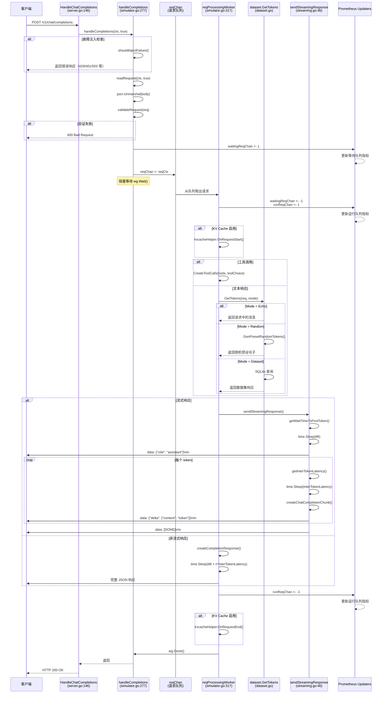

# 核心调用链

本文档详细描述 llm-d-inference-sim 项目的核心函数调用链，包括主要业务流程、错误处理、并发机制和中间件逻辑。

---

## 一、Chat Completion 请求处理调用树

这是最核心的业务流程，展示了从接收 HTTP 请求到返回响应的完整调用链。

### 1.1 完整调用树

```
HandleChatCompletions (server.go:146)
  │ 作用：HTTP 处理器，接收 /v1/chat/completions 请求
  │
  └─→ handleCompletions(ctx, isChatCompletion=true) (simulator.go:277)
      │ 作用：通用 Completion 处理逻辑（支持 Chat 和 Text 两种模式）
      │
      ├─→ [分支：故障注入检查]
      │   └─→ shouldInjectFailure(config) (failures.go:47)
      │       │ 作用：根据配置的故障注入率决定是否注入故障
      │       │
      │       └─→ getRandomFailure(config) (failures.go:56)
      │           │ 作用：随机选择一个预定义的故障类型
      │           │
      │           └─→ sendCompletionError(ctx, failure, isInjected=true) (server.go:270)
      │               │ 作用：发送错误响应（JSON 格式）
      │               └─→ [返回错误并结束]
      │
      ├─→ readRequest(ctx, isChatCompletion=true) (server.go:108)
      │   │ 作用：读取并解析 HTTP 请求体为 ChatCompletionRequest
      │   │
      │   ├─→ json.Unmarshal(ctx.Request.Body(), &req)
      │   │   │ 作用：将 JSON 请求体反序列化为结构体
      │   │
      │   └─→ [循环：验证所有工具]
      │       └─→ toolsValidator.ValidateTool(toolJson) (tools_utils.go)
      │           │ 作用：使用 JSON Schema 验证工具定义的合法性
      │           └─→ jsonschema.Compile() / Validate()
      │
      ├─→ validateRequest(vllmReq) (server.go:220)
      │   │ 作用：验证请求参数的合法性（模型名、token 数量、上下文窗口等）
      │   │
      │   ├─→ isValidModel(req.GetModel()) (helpers.go:26)
      │   │   │ 作用：检查模型名是否是基础模型或已加载的 LoRA
      │   │
      │   └─→ common.ValidateContextWindow(promptTokens, completionTokens, maxModelLen)
      │       │ 作用：验证 prompt + completion 不超过上下文窗口大小
      │
      ├─→ [创建请求上下文并发送到 Worker 队列]
      │   │
      │   ├─→ waitingReqChan <- 1 (simulator.go:307)
      │   │   │ 作用：增加等待请求计数（Prometheus 指标更新）
      │   │
      │   ├─→ lorasChan <- loraUsage{name, waitingUsageState} (simulator.go:310)
      │   │   │ 作用：如果是 LoRA 请求，更新 LoRA 等待队列指标
      │   │
      │   └─→ reqChan <- reqCtx (simulator.go:313)
      │       │ 作用：将请求发送到 Worker 队列（channel）
      │
      └─→ wg.Wait() (simulator.go:314)
          │ 作用：等待请求处理完成（同步点）
```

### 1.2 Worker 处理流程

```
reqProcessingWorker (simulator.go:317)
  │ 作用：后台 Worker goroutine（MaxNumSeqs 个并发），从队列中取请求并处理
  │
  ├─→ [循环：监听 Context 和请求队列]
  │   │
  │   └─→ select {
  │       ├─ case <-ctx.Done(): return (优雅关闭)
  │       └─ case reqCtx := <-reqChan:
  │
  ├─→ waitingReqChan <- -1 (simulator.go:334)
  │   │ 作用：减少等待计数
  │   │
  ├─→ runReqChan <- 1 (simulator.go:335)
  │   │ 作用：增加运行计数
  │   │
  ├─→ lorasChan <- loraUsage{model, runningUsageState} (simulator.go:340)
  │   │ 作用：更新 LoRA 运行状态
  │   │
  ├─→ [分支：KV Cache 支持]
  │   └─→ kvcacheHelper.OnRequestStart(req) (kv_cache.go)
  │       │ 作用：处理 KV Cache 块分配和预填充逻辑
  │       │
  │       └─→ kvcacheSender.SendEvent(event) (kv_cache_sender.go)
  │           │ 作用：通过 ZMQ 发送 KV Cache 事件
  │
  ├─→ [分支：生成响应内容]
  │   │
  │   ├─→ [工具调用分支]
  │   │   └─→ openaiserverapi.CreateToolCalls(tools, toolChoice, config) (tools_utils.go:58)
  │   │       │ 作用：生成工具调用的参数（随机生成符合 Schema 的 JSON）
  │   │       │
  │   │       └─→ GenerateToolArguments(tool, config) (tools_utils.go:114)
  │   │           │ 作用：为每个工具参数生成随机值
  │   │           │
  │   │           └─→ CreateArgument(property, config) (tools_utils.go:135)
  │   │               │ 作用：根据参数类型（string/int/array/object）生成值
  │   │
  │   └─→ [文本响应分支]
  │       └─→ dataset.GetTokens(req, config.Mode) (dataset.go)
  │           │ 作用：根据模式（echo/random/dataset）生成响应 token
  │           │
  │           ├─→ [Mode=echo] → 返回请求中的最后一条消息
  │           │
  │           ├─→ [Mode=random] → GenPresetRandomTokens(numOfTokens)
  │           │   │ 作用：从预设句子库随机选择并分词
  │           │
  │           └─→ [Mode=dataset] → customDataset.GetTokens(req)
  │               │ 作用：从 SQLite 数据集中查询匹配的对话历史
  │               │
  │               └─→ db.Query("SELECT response FROM conversations WHERE hash = ?")
  │                   │ 作用：基于对话哈希查询数据库
  │
  ├─→ [分支：流式响应]
  │   └─→ sendStreamingResponse(streamingCtx, tokens, toolCalls, finishReason, usage)
  │       │ (streaming.go:46)
  │       │ 作用：以 Server-Sent Events (SSE) 格式流式发送响应
  │       │
  │       ├─→ ctx.SetBodyStreamWriter(func(w *bufio.Writer) { ... })
  │       │   │ 作用：设置流式写入器
  │       │
  │       ├─→ sendTokenChunks(ctx, w, tokens, toolCall, finishReason) (streaming.go:101)
  │       │   │ 作用：逐个发送 token chunk
  │       │   │
  │       │   ├─→ getWaitTimeToFirstToken(nPromptTokens, nCached, doRemotePrefill)
  │       │   │   │ (latencies.go:42)
  │       │   │   │ 作用：计算首 token 延迟（TTFT）
  │       │   │   │
  │       │   │   ├─→ [分支：Disaggregated Prefill/Decode]
  │       │   │   │   └─→ common.RandomNorm(kvCacheTransferLatency, stdDev)
  │       │   │   │       │ 作用：模拟 KV Cache 传输延迟（带正态分布噪声）
  │       │   │   │
  │       │   │   └─→ [分支：Aggregated Prefill/Decode]
  │       │   │       └─→ getPrefillOverhead() + nPromptTokens * getPrefillTimePerToken()
  │       │   │           │ 作用：根据 prompt token 数量计算预填充时间
  │       │   │           │
  │       │   │           └─→ getCurrLoadFactor() (latencies.go:22)
  │       │   │               │ 作用：根据当前并发请求数计算负载因子
  │       │   │
  │       │   ├─→ time.Sleep(ttft) (streaming.go:105)
  │       │   │   │ 作用：延迟首 token
  │       │   │
  │       │   ├─→ [循环：逐个发送 token]
  │       │   │   │
  │       │   │   ├─→ getInterTokenLatency() (latencies.go:62)
  │       │   │   │   │ 作用：计算 token 间延迟（带负载因子和噪声）
  │       │   │   │
  │       │   │   ├─→ time.Sleep(interTokenLatency) (streaming.go:109)
  │       │   │   │
  │       │   │   ├─→ createChatCompletionChunk(ctx, token, toolCall, role, finishReason)
  │       │   │   │   │ (streaming.go:203)
  │       │   │   │   │ 作用：创建单个 SSE chunk（包含 token 或工具调用）
  │       │   │   │
  │       │   │   └─→ sendChunk(w, chunk, "") (streaming.go:234)
  │       │   │       │ 作用：以 SSE 格式写入 chunk（data: {json}\n\n）
  │       │   │       │
  │       │   │       └─→ fmt.Fprintf(w, "data: %s\n\n", dataString)
  │       │   │           └─→ w.Flush()
  │       │   │
  │       │   └─→ sendChunk(w, nil, "[DONE]") (streaming.go:92)
  │       │       │ 作用：发送 SSE 结束标记
  │       │
  │       └─→ responseSentCallback(model, isChatCompletion, requestID) (streaming.go:96)
  │           │ 作用：清理资源和更新指标
  │
  └─→ [分支：非流式响应]
      └─→ sendResponse(reqCtx, tokens, toolCalls, model, finishReason, usage)
          │ (simulator.go:491)
          │ 作用：一次性返回完整响应
          │
          ├─→ createCompletionResponse(isChatCompletion, tokens, toolCalls, finishReason, usage, model, doRemoteDecode)
          │   │ (simulator.go:438)
          │   │ 作用：构造 ChatCompletionResponse 或 TextCompletionResponse
          │   │
          │   └─→ [返回结构体]
          │       ├─ ID: "chatcmpl-" + UUID
          │       ├─ Model: displayModelName
          │       ├─ Choices: [{ Message/Text, FinishReason }]
          │       └─ Usage: { PromptTokens, CompletionTokens, TotalTokens }
          │
          ├─→ [延迟模拟]
          │   ├─→ time.Sleep(ttft)
          │   └─→ [循环 completionTokens-1 次]
          │       └─→ time.Sleep(interTokenLatency)
          │
          ├─→ sendCompletionResponse(ctx, resp) (server.go:249)
          │   │ 作用：发送 JSON 响应（包含 Pod/Namespace Header）
          │   │
          │   └─→ json.Marshal(resp) → ctx.Response.SetBody(data)
          │
          └─→ responseSentCallback(model, isChatCompletion, requestID) (simulator.go:414)
              │ 作用：清理资源和更新指标
              │
              ├─→ runReqChan <- -1 (减少运行请求计数)
              ├─→ lorasChan <- loraUsage{model, doneUsageState}
              └─→ kvcacheHelper.OnRequestEnd(requestID)
```

---

## 二、其他端点调用链

### 2.1 Text Completion 请求（/v1/completions）

```
HandleTextCompletions (server.go:152)
  │ 作用：HTTP 处理器，接收 /v1/completions 请求
  │
  └─→ handleCompletions(ctx, isChatCompletion=false) (simulator.go:277)
      │ 作用：与 Chat Completion 共享逻辑，仅 isChatCompletion 标志不同
      │
      └─→ [与 Chat Completion 相同的流程]
          ├─→ readRequest(ctx, isChatCompletion=false)
          │   │ 作用：解析为 TextCompletionRequest
          │
          └─→ [后续逻辑相同]
```

### 2.2 模型列表请求（/v1/models）

```
HandleModels (server.go:293)
  │ 作用：HTTP 处理器，返回可用模型列表
  │
  └─→ createModelsResponse() (simulator.go:511)
      │ 作用：构造 ModelsResponse 结构体
      │
      ├─→ [循环：添加基础模型别名]
      │   └─→ for _, alias := range config.ServedModelNames
      │       └─→ append(modelsResp.Data, ModelInfo{ ID: alias, Parent: nil })
      │
      ├─→ [循环：添加 LoRA 适配器]
      │   └─→ for _, lora := range getLoras()
      │       │ 作用：遍历 loraAdaptors sync.Map
      │       │
      │       └─→ append(modelsResp.Data, ModelInfo{ ID: lora, Parent: &baseModel })
      │
      └─→ json.Marshal(modelsResp) → 返回 JSON
```

### 2.3 加载 LoRA 适配器（/v1/load_lora_adapter）

```
HandleLoadLora (server.go:210)
  │ 作用：HTTP 处理器，加载 LoRA 适配器
  │
  └─→ loadLora(ctx) (lora.go:50)
      │ 作用：将 LoRA 适配器添加到内存 Map
      │
      ├─→ json.Unmarshal(ctx.Request.Body(), &req)
      │   │ 作用：解析请求体 { "lora_name": "...", "lora_path": "..." }
      │
      └─→ loraAdaptors.Store(req.LoraName, "") (lora.go:59)
          │ 作用：存储到线程安全的 sync.Map
```

### 2.4 卸载 LoRA 适配器（/v1/unload_lora_adapter）

```
HandleUnloadLora (server.go:215)
  │ 作用：HTTP 处理器，卸载 LoRA 适配器
  │
  └─→ unloadLora(ctx) (lora.go:62)
      │ 作用：从内存 Map 中删除 LoRA 适配器
      │
      ├─→ json.Unmarshal(ctx.Request.Body(), &req)
      │   │ 作用：解析请求体 { "lora_name": "..." }
      │
      └─→ loraAdaptors.Delete(req.LoraName) (lora.go:71)
          │ 作用：从 sync.Map 删除
```

### 2.5 分词请求（/tokenize）

```
HandleTokenize (server.go:168)
  │ 作用：HTTP 处理器，对输入文本进行分词
  │
  ├─→ readTokenizeRequest(ctx) (server.go:158)
  │   │ 作用：解析 TokenizeRequest { Prompt, Messages, Model }
  │
  ├─→ tokenizer.Encode(req.GetPrompt(), model) (HuggingFace Tokenizer)
  │   │ 作用：使用 daulet/tokenizers 库进行分词
  │   │
  │   └─→ [CGO 调用 libtokenizers.a]
  │
  └─→ json.Marshal(TokenizeResponse{ Count, Tokens, MaxModelLen })
      └─→ 返回 JSON
```

### 2.6 健康检查（/health 和 /ready）

```
HandleHealth (server.go:313)
  │ 作用：Kubernetes 健康检查端点
  │
  └─→ ctx.Response.SetBody([]byte("{}"))
      │ 作用：返回空 JSON（200 OK）

HandleReady (server.go:321)
  │ 作用：Kubernetes 就绪检查端点
  │
  └─→ ctx.Response.SetBody([]byte("{}"))
      │ 作用：返回空 JSON（200 OK）
```

---

## 三、并发与异步机制

### 3.1 请求处理 Worker Pool

```
启动 Worker Pool (simulator.go:225-227)
  │
  └─→ [循环 MaxNumSeqs 次]
      └─→ go reqProcessingWorker(ctx, workerID)
          │ 作用：每个 Worker 从 reqChan 读取请求并处理
          │
          └─→ [阻塞监听]
              ├─→ select { case <-ctx.Done() → 退出 }
              └─→ select { case req := <-reqChan → 处理请求 }
```

**关键点**：
- **Channel 容量**：`reqChan` 容量为 1000（`maxNumberOfRequests`）
- **并发限制**：最多 `MaxNumSeqs` 个请求同时处理
- **背压机制**：当 Worker 全忙且队列满时，新请求会阻塞在 `reqChan <- reqCtx`

### 3.2 Prometheus 指标更新器

```
startMetricsUpdaters (metrics.go:196)
  │ 作用：启动 4 个指标更新 goroutine
  │
  ├─→ go waitingRequestsUpdater(ctx)
  │   │ 作用：监听 waitingReqChan，更新等待请求计数
  │   │
  │   └─→ select {
  │       ├─ case <-ctx.Done() → 退出
  │       └─ case inc := <-waitingReqChan → nWaitingReqs += inc
  │           └─→ reportWaitingRequests() (更新 Prometheus Gauge)
  │
  ├─→ go runningRequestsUpdater(ctx)
  │   │ 作用：监听 runReqChan，更新运行请求计数
  │   │
  │   └─→ select {
  │       ├─ case <-ctx.Done() → 退出
  │       └─ case inc := <-runReqChan → nRunningReqs += inc
  │           └─→ reportRunningRequests() (更新 Prometheus Gauge)
  │
  ├─→ go lorasUpdater(ctx)
  │   │ 作用：监听 lorasChan，更新 LoRA 状态
  │   │
  │   └─→ select {
  │       ├─ case <-ctx.Done() → 退出
  │       └─ case loraUpdate := <-lorasChan:
  │           ├─→ [waitingUsageState] → incrementLoraRefCount(&waitingLoras)
  │           ├─→ [runningUsageState] → decrementLoraRefCount(&waitingLoras)
  │           │                         + incrementLoraRefCount(&runningLoras)
  │           └─→ [doneUsageState] → decrementLoraRefCount(&runningLoras)
  │               └─→ reportLoras() (更新 Prometheus Gauge)
  │
  └─→ go kvCacheUsageUpdater(ctx)
      │ 作用：监听 kvCacheUsageChan，更新 KV Cache 使用率
      │
      └─→ select {
          ├─ case <-ctx.Done() → 退出
          └─ case value := <-kvCacheUsageChan → reportKVCacheUsage(value)
```

**关键点**：
- **解耦设计**：业务逻辑通过 Channel 发送指标更新事件，Updater 异步处理
- **线程安全**：使用 `sync.Map` 存储 LoRA 引用计数

### 3.3 KV Cache 事件发布器

```
kvcacheHelper.Run(ctx) (kv_cache.go)
  │ 作用：异步处理 KV Cache 事件并通过 ZMQ 发布
  │
  ├─→ [循环：监听事件队列]
  │   └─→ select {
  │       ├─ case <-ctx.Done() → 退出
  │       └─ case event := <-eventQueue:
  │           └─→ kvcacheSender.SendEvent(event) (kv_cache_sender.go)
  │               │ 作用：序列化事件并通过 ZMQ Socket 发送
  │               │
  │               └─→ zmq.Socket.Send(msgpack.Marshal(event))
  │
  └─→ [批量发送优化]
      └─→ 累积 EventBatchSize 个事件后一次性发送
```

---

## 四、错误处理与中间件

### 4.1 错误处理流程

```
错误处理分支
  │
  ├─→ [HTTP 解析错误]
  │   └─→ json.Unmarshal() 失败
  │       └─→ ctx.Error("Failed to parse request", 400)
  │
  ├─→ [请求验证错误]
  │   └─→ validateRequest() 返回错误消息
  │       └─→ sendCompletionError(ctx, error, isInjected=false)
  │           │ 作用：发送 OpenAI 格式的错误响应
  │           │
  │           └─→ json.Marshal(ErrorResponse{ Error: { Type, Message, Code, Param } })
  │
  ├─→ [故障注入]
  │   └─→ shouldInjectFailure(config) 返回 true
  │       └─→ getRandomFailure(config) → 随机选择故障类型
  │           └─→ sendCompletionError(ctx, failure, isInjected=true)
  │               │ 作用：发送预定义的错误（Rate Limit、Invalid API Key 等）
  │
  ├─→ [工具验证错误]
  │   └─→ toolsValidator.ValidateTool(toolJson) 失败
  │       └─→ ctx.Error("Tool validation failed", 400)
  │
  └─→ [服务器错误]
      └─→ HandleError(ctx, err) (server.go:308)
          │ 作用：fasthttp 的全局错误处理器
          │
          └─→ logger.Error(err, "VLLM server error")
```

### 4.2 中间件机制

虽然 fasthttp 不像传统框架有显式的中间件链，但项目通过以下方式实现中间件功能：

```
中间件功能实现
  │
  ├─→ [日志中间件]
  │   └─→ 每个 Handler 函数开头调用 logger.Info()
  │       ├─→ HandleChatCompletions → logger.Info("chat completion request received")
  │       └─→ HandleTextCompletions → logger.Info("completion request received")
  │
  ├─→ [Pod/Namespace Header 注入]
  │   └─→ sendCompletionResponse() 和 sendStreamingResponse()
  │       └─→ ctx.Response.Header.Add(podHeader, s.pod)
  │           ctx.Response.Header.Add(namespaceHeader, s.namespace)
  │
  ├─→ [指标收集]
  │   └─→ 每个请求自动更新 Prometheus 指标
  │       ├─→ waitingReqChan <- 1 (请求入队)
  │       ├─→ runReqChan <- 1 (开始处理)
  │       └─→ runReqChan <- -1 (处理完成)
  │
  └─→ [错误处理中间件]
      └─→ HandleError(ctx, err) (全局错误处理器)
```

---

## 五、Mermaid 时序图：Chat Completion 主干流程



---

## 六、关键分支说明

### 6.1 故障注入分支

**触发条件**：`config.FailureInjectionRate > 0` 且随机数满足条件

**可能的错误类型**：
- `rate_limit` (429)
- `invalid_api_key` (401)
- `context_length` (400)
- `server_error` (503)
- `invalid_request` (400)
- `model_not_found` (404)

**代码位置**：`simulator.go:279` → `failures.go:47`

### 6.2 流式 vs 非流式响应分支

**判断条件**：`req.Stream == true`

**流式响应特点**：
- 使用 SSE 格式（`text/event-stream`）
- 逐 token 发送，每个 token 间延迟 `interTokenLatency`
- 最后发送 `data: [DONE]\n\n`

**非流式响应特点**：
- 一次性返回完整 JSON
- 延迟累积后再发送（模拟真实推理时间）

**代码位置**：`simulator.go:383`

### 6.3 KV Cache 分支

**触发条件**：`config.EnableKVCache == true` 且 `!isChatCompletion`

**逻辑**：
- 请求开始时分配 KV Cache 块
- 计算 Cache Hit Rate
- 通过 ZMQ 发布事件到 KV Cache Manager
- 请求结束时释放 Cache 块

**代码位置**：`simulator.go:343` 和 `simulator.go:423`

### 6.4 LoRA 请求分支

**判断条件**：`isLora(req.GetModel()) == true`

**逻辑**：
- 更新 LoRA 等待/运行状态
- 在 Prometheus 指标中单独追踪
- 模型名称显示为 LoRA 名称而非基础模型

**代码位置**：`simulator.go:308` 和 `simulator.go:337`

### 6.5 Disaggregated Prefill/Decode 分支

**判断条件**：
- `req.IsDoRemotePrefill() == true` → 远程预填充（Decode Pod）
- `req.IsDoRemoteDecode() == true` → 远程解码（Prefill Pod）

**逻辑**：
- **远程预填充**：使用 `KVCacheTransferLatency` 代替 `TimeToFirstToken`
- **远程解码**：返回 `finish_reason: "remote_decode"` 和虚拟的 Block IDs

**代码位置**：`latencies.go:42` 和 `simulator.go:400`

---

## 七、关键数据流

### 7.1 请求处理的数据流

```
HTTP Request Body (JSON)
  ↓
ChatCompletionRequest 结构体
  ↓
CompletionReqCtx {
  CompletionReq: ChatCompletionRequest
  HTTPReqCtx: *fasthttp.RequestCtx
  IsChatCompletion: bool
  Wg: *sync.WaitGroup
}
  ↓
reqChan (Channel)
  ↓
Worker Goroutine
  ↓
Dataset.GetTokens() → []string (tokens)
  ↓
ChatCompletionResponse 结构体
  ↓
JSON.Marshal()
  ↓
HTTP Response Body (JSON)
```

### 7.2 指标更新的数据流

```
业务逻辑层
  ↓
waitingReqChan <- 1 / runReqChan <- 1 / lorasChan <- loraUsage
  ↓
指标更新器 Goroutine
  ↓
nWaitingReqs / nRunningReqs / runningLoras / waitingLoras
  ↓
Prometheus Gauge.Set()
  ↓
GET /metrics → Prometheus 拉取指标
```

### 7.3 KV Cache 事件流

```
Worker: OnRequestStart()
  ↓
KVCacheHelper: AllocateBlocks()
  ↓
Event { Type: "allocate", BlockIDs: [...] }
  ↓
eventQueue (Channel)
  ↓
KVCacheSender Goroutine
  ↓
msgpack.Marshal(event)
  ↓
ZMQ Socket.Send()
  ↓
KV Cache Manager (外部服务)
```

---

## 八、性能关键路径

### 高延迟路径（Hot Path）

1. **请求入队** → `reqChan <- reqCtx`（可能阻塞）
2. **首 token 延迟** → `time.Sleep(ttft)`（模拟推理）
3. **token 间延迟** → `time.Sleep(interTokenLatency)` × N（模拟生成）
4. **数据集查询** → SQLite `SELECT` 查询（如果使用 CustomDataset）
5. **ZMQ 发送** → 网络 I/O（如果启用 KV Cache）

### 优化点

- **Worker Pool**：增加 `MaxNumSeqs` 可提高并发
- **Channel 容量**：`reqChan` 容量为 1000，避免阻塞
- **数据集内存加载**：`--dataset-in-memory` 避免磁盘 I/O
- **指标更新异步化**：通过 Channel 解耦，避免锁竞争

---

## 九、函数调用树总结表

| 层级 | 函数 | 文件 | 作用 |
|-----|------|------|------|
| 1 | `HandleChatCompletions` | `server.go:146` | HTTP 入口 |
| 2 | `handleCompletions` | `simulator.go:277` | 通用处理逻辑 |
| 3 | `shouldInjectFailure` | `failures.go:47` | 故障注入检查 |
| 3 | `readRequest` | `server.go:108` | 解析请求体 |
| 3 | `validateRequest` | `server.go:220` | 验证请求参数 |
| 3 | `reqChan <- reqCtx` | `simulator.go:313` | 发送到队列 |
| 2 | `reqProcessingWorker` | `simulator.go:317` | Worker 处理 |
| 3 | `CreateToolCalls` | `tools_utils.go:58` | 生成工具调用 |
| 3 | `dataset.GetTokens` | `dataset.go` | 生成响应 token |
| 3 | `sendStreamingResponse` | `streaming.go:46` | 流式响应 |
| 4 | `sendTokenChunks` | `streaming.go:101` | 发送 token chunk |
| 5 | `getWaitTimeToFirstToken` | `latencies.go:42` | 计算 TTFT |
| 5 | `getInterTokenLatency` | `latencies.go:62` | 计算 token 间延迟 |
| 5 | `sendChunk` | `streaming.go:234` | 发送 SSE chunk |
| 3 | `sendResponse` | `simulator.go:491` | 非流式响应 |
| 4 | `createCompletionResponse` | `simulator.go:438` | 构造响应结构 |
| 4 | `sendCompletionResponse` | `server.go:249` | 发送 JSON 响应 |
| 3 | `responseSentCallback` | `simulator.go:414` | 清理和更新指标 |

---

## 十、关键文件速查

| 功能模块 | 文件路径 | 核心函数 |
|---------|---------|---------|
| HTTP 路由 | `pkg/llm-d-inference-sim/server.go` | `HandleChatCompletions`, `HandleTextCompletions`, `startServer` |
| 请求处理 | `pkg/llm-d-inference-sim/simulator.go` | `handleCompletions`, `reqProcessingWorker`, `sendResponse` |
| 流式响应 | `pkg/llm-d-inference-sim/streaming.go` | `sendStreamingResponse`, `sendTokenChunks`, `sendChunk` |
| 延迟模拟 | `pkg/llm-d-inference-sim/latencies.go` | `getWaitTimeToFirstToken`, `getInterTokenLatency` |
| 数据集 | `pkg/dataset/dataset.go` | `GetTokens`, `GenPresetRandomTokens` |
| 工具调用 | `pkg/openai-server-api/tools_utils.go` | `CreateToolCalls`, `GenerateToolArguments` |
| LoRA 管理 | `pkg/llm-d-inference-sim/lora.go` | `loadLora`, `unloadLora`, `getLoras` |
| 指标更新 | `pkg/llm-d-inference-sim/metrics.go` | `startMetricsUpdaters`, `reportRunningRequests` |
| 故障注入 | `pkg/llm-d-inference-sim/failures.go` | `shouldInjectFailure`, `getRandomFailure` |
| KV Cache | `pkg/kv-cache/kv_cache.go` | `OnRequestStart`, `OnRequestEnd` |

---

## 十一、调用链关键点总结

1. **入口层**：HTTP Handler → 通用处理逻辑
2. **验证层**：故障注入检查 → 请求解析 → 参数验证
3. **队列层**：请求入队 → Worker 并发处理
4. **生成层**：工具调用/文本生成 → 延迟模拟
5. **响应层**：流式/非流式响应 → 指标更新
6. **清理层**：资源释放 → KV Cache 清理 → 指标回调

整个调用链设计遵循 **生产者-消费者模式**，通过 Channel 实现异步解耦，利用 Worker Pool 实现并发控制，使用 Context 实现优雅关闭。
