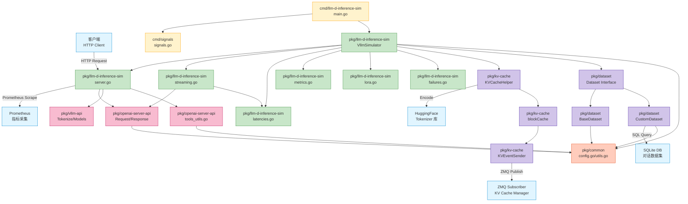
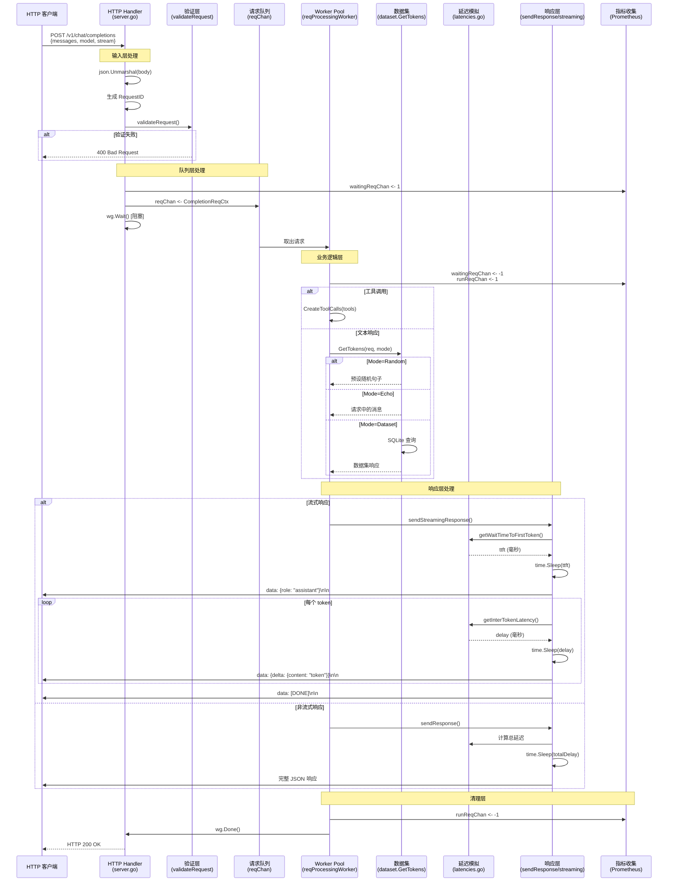

# 模块依赖与数据流

本文档描述 llm-d-inference-sim 项目的模块依赖关系、核心数据结构、典型请求处理流程和 API 接口定义。

---

## 一、模块依赖关系图

### 1.1 整体架构依赖图



### 1.2 包依赖层次

```
层级 1（入口层）
  └─ cmd/llm-d-inference-sim
  └─ cmd/signals

层级 2（核心业务层）
  └─ pkg/llm-d-inference-sim
      ├─ 依赖：pkg/openai-server-api
      ├─ 依赖：pkg/vllm-api
      ├─ 依赖：pkg/dataset
      ├─ 依赖：pkg/kv-cache
      └─ 依赖：pkg/common

层级 3（API 抽象层）
  ├─ pkg/openai-server-api
  │   └─ 依赖：pkg/common
  │
  └─ pkg/vllm-api
      └─ 依赖：pkg/openai-server-api

层级 4（数据与工具层）
  ├─ pkg/dataset
  │   └─ 依赖：pkg/common, pkg/openai-server-api
  │
  ├─ pkg/kv-cache
  │   └─ 依赖：pkg/common, llm-d-kv-cache-manager (外部库)
  │
  └─ pkg/common（无内部依赖，纯工具库）
```

### 1.3 外部依赖

| 外部库 | 用途 | 包 |
|-------|------|-----|
| `valyala/fasthttp` | HTTP 服务器框架 | `pkg/llm-d-inference-sim` |
| `buaazp/fasthttprouter` | HTTP 路由 | `pkg/llm-d-inference-sim` |
| `prometheus/client_golang` | Prometheus 指标 | `pkg/llm-d-inference-sim` |
| `pebbe/zmq4` | ZeroMQ 消息发布（CGO） | `pkg/kv-cache` |
| `mattn/go-sqlite3` | SQLite 数据库（CGO） | `pkg/dataset` |
| `daulet/tokenizers` | HuggingFace Tokenizer（CGO） | `pkg/kv-cache` |
| `llm-d-kv-cache-manager` | KV Cache 管理库 | `pkg/kv-cache` |
| `santhosh-tekuri/jsonschema/v5` | JSON Schema 验证 | `pkg/openai-server-api` |
| `k8s.io/klog/v2` | Kubernetes 风格日志 | 全局 |
| `spf13/pflag` | 命令行参数解析 | `pkg/common` |

---

## 二、核心数据结构

### 2.1 模拟器核心结构

#### VllmSimulator（pkg/llm-d-inference-sim/simulator.go:72）

```go
type VllmSimulator struct {
    // 基础设施
    logger           logr.Logger           // 日志器
    config           *Configuration        // 配置

    // LoRA 管理
    loraAdaptors     sync.Map              // LoRA 适配器存储（线程安全）
    runningLoras     sync.Map              // 运行中的 LoRA 计数
    waitingLoras     sync.Map              // 等待队列中的 LoRA 计数
    lorasChan        chan loraUsage        // LoRA 状态更新 Channel

    // 请求队列
    reqChan          chan *CompletionReqCtx // 请求队列（容量 1000）
    nRunningReqs     int64                  // 运行中的请求数
    nWaitingReqs     int64                  // 等待中的请求数
    runReqChan       chan int64             // 运行请求计数更新 Channel
    waitingReqChan   chan int64             // 等待请求计数更新 Channel

    // KV Cache
    kvcacheHelper    *KVCacheHelper        // KV Cache 辅助器（可选）
    kvCacheUsageChan chan float64          // KV Cache 使用率更新 Channel

    // Prometheus 指标
    registry              *prometheus.Registry
    loraInfo              *prometheus.GaugeVec
    runningRequests       *prometheus.GaugeVec
    waitingRequests       *prometheus.GaugeVec
    kvCacheUsagePercentage *prometheus.GaugeVec

    // 业务组件
    toolsValidator   *Validator            // JSON Schema 验证器
    tokenizer        Tokenizer             // HuggingFace Tokenizer
    dataset          Dataset               // 数据集（随机/SQLite）

    // 环境信息
    namespace        string                // Kubernetes Namespace
    pod              string                // Kubernetes Pod Name
}
```

**职责**：
- 管理整个模拟器的生命周期
- 协调请求处理、指标收集、KV Cache 管理
- 提供线程安全的 LoRA 和请求状态管理

---

### 2.2 请求/响应数据结构

#### CompletionRequest 接口（pkg/openai-server-api/request.go:33）

```go
type CompletionRequest interface {
    GetRequestID() string
    IsStream() bool
    GetModel() string
    IncludeUsage() bool
    GetNumberOfPromptTokens() int
    GetNumberOfCachedPromptTokens() int
    SetNumberOfCachedPromptTokens(int)
    GetPrompt() string
    GetTools() []Tool
    GetToolChoice() string
    GetMaxCompletionTokens() *int64
    GetIgnoreEOS() bool
    IsDoRemoteDecode() bool
    IsDoRemotePrefill() bool
    GetFullPrompt() string
}
```

**职责**：定义统一的请求接口，支持 Chat Completion 和 Text Completion 两种类型

---

#### ChatCompletionRequest（pkg/openai-server-api/request.go:157）

```go
type ChatCompletionRequest struct {
    BaseCompletionRequest
    Messages            []Message  // 对话消息列表
    MaxTokens           *int64     // 最大 token 数（已废弃）
    MaxCompletionTokens *int64     // 最大完成 token 数
    Tools               []Tool     // 工具定义列表
    ToolChoice          string     // 工具选择策略（none/auto/required）
}
```

**职责**：表示 OpenAI Chat Completion API 请求

---

#### TextCompletionRequest（pkg/openai-server-api/request.go:258）

```go
type TextCompletionRequest struct {
    BaseCompletionRequest
    Prompt    string  // 文本 Prompt
    MaxTokens *int64  // 最大 token 数
}
```

**职责**：表示 OpenAI Text Completion API 请求

---

#### BaseCompletionRequest（pkg/openai-server-api/request.go:73）

```go
type BaseCompletionRequest struct {
    RequestID           string      // 请求唯一 ID
    Stream              bool        // 是否流式响应
    StreamOptions       StreamOptions
    Model               string      // 模型名称
    DoRemoteDecode      bool        // 远程解码标志（Prefill Pod）
    DoRemotePrefill     bool        // 远程预填充标志（Decode Pod）
    RemoteBlockIds      []string    // 远程 KV Cache 块 ID
    RemoteEngineId      string      // 远程引擎 ID
    RemoteHost          string      // 远程主机地址
    RemotePort          int         // 远程端口
    cachedPromptTokens  int         // 本地 KV Cache 命中的 token 数
    IgnoreEOS           bool        // 忽略 EOS Token
}
```

**职责**：包含所有请求类型的公共字段

---

#### CompletionReqCtx（pkg/openai-server-api/request.go:149）

```go
type CompletionReqCtx struct {
    CompletionReq    CompletionRequest    // 请求接口实例
    HTTPReqCtx       *fasthttp.RequestCtx // fasthttp 上下文
    IsChatCompletion bool                 // 是否为 Chat Completion
    Wg               *sync.WaitGroup      // 同步等待组
}
```

**职责**：封装请求处理的上下文，用于在 Worker Pool 中传递

---

#### ChatCompletionResponse（pkg/openai-server-api/response.go:68）

```go
type ChatCompletionResponse struct {
    BaseCompletionResponse
    Choices []ChatRespChoice  // 响应选择列表
}

type ChatRespChoice struct {
    BaseResponseChoice
    Message Message  // 响应消息
}

type Message struct {
    Role      string      // 角色（user/assistant）
    Content   Content     // 消息内容
    ToolCalls []ToolCall  // 工具调用列表
}
```

**职责**：表示 Chat Completion API 响应

---

#### TextCompletionResponse（pkg/openai-server-api/response.go:181）

```go
type TextCompletionResponse struct {
    BaseCompletionResponse
    Choices []TextRespChoice  // 响应选择列表
}

type TextRespChoice struct {
    BaseResponseChoice
    Text string  // 响应文本
}
```

**职责**：表示 Text Completion API 响应

---

#### Usage（pkg/openai-server-api/response.go:58）

```go
type Usage struct {
    PromptTokens     int  // Prompt token 数
    CompletionTokens int  // 完成 token 数
    TotalTokens      int  // 总 token 数
}
```

**职责**：表示 token 使用统计

---

### 2.3 配置结构

#### Configuration（pkg/common/config.go:48）

```go
type Configuration struct {
    // 服务器配置
    Port             int       // HTTP 端口
    Model            string    // 基础模型名称
    ServedModelNames []string  // API 暴露的模型别名

    // 性能配置
    MaxNumSeqs      int    // 最大并发请求数
    MaxModelLen     int    // 上下文窗口大小
    MaxLoras        int    // 最大 LoRA 数量
    MaxCPULoras     int    // 最大 CPU LoRA 数量

    // 延迟配置
    TimeToFirstToken         int  // 首 token 延迟（毫秒）
    TimeToFirstTokenStdDev   int  // 首 token 延迟标准差
    InterTokenLatency        int  // token 间延迟（毫秒）
    InterTokenLatencyStdDev  int  // token 间延迟标准差
    PrefillOverhead          int  // 预填充开销（毫秒）
    PrefillTimePerToken      int  // 预填充每 token 时间
    KVCacheTransferLatency   int  // KV Cache 传输延迟
    TimeFactorUnderLoad      float64  // 负载因子（≥1.0）

    // 响应模式
    Mode  string  // 响应生成模式（echo/random）
    Seed  int64   // 随机种子

    // KV Cache 配置
    EnableKVCache       bool    // 启用 KV Cache
    KVCacheSize         int     // KV Cache 大小（块数）
    TokenBlockSize      int     // Token 块大小（8/16/32/64/128）
    TokenizersCacheDir  string  // Tokenizer 缓存目录
    HashSeed            string  // 哈希种子
    ZMQEndpoint         string  // ZMQ 端点地址
    EventBatchSize      int     // 事件批量大小

    // 数据集配置
    DatasetPath      string  // SQLite 数据集路径
    DatasetURL       string  // SQLite 数据集下载 URL
    DatasetInMemory  bool    // 是否加载到内存

    // 故障注入
    FailureInjectionRate int       // 故障注入率（0-100）
    FailureTypes         []string  // 故障类型列表

    // 其他
    DPSize          int     // Data Parallel 大小（1-8）
    SSLCertFile     string  // TLS 证书文件
    SSLKeyFile      string  // TLS 私钥文件
    SelfSignedCerts bool    // 自动生成自签名证书
    LoraModules     []LoraModule  // LoRA 模块列表
    FakeMetrics     *Metrics      // 假指标（测试用）
}
```

**职责**：存储所有配置参数，支持 YAML 文件和命令行参数

---

### 2.4 KV Cache 结构

#### KVCacheHelper（pkg/kv-cache/kv_cache.go:30）

```go
type KVCacheHelper struct {
    tokenizer       Tokenizer        // HuggingFace Tokenizer
    tokensProcessor TokenProcessor   // Token 转 KV 块键
    blockCache      *blockCache      // 块缓存管理器
    blockSize       int              // 块大小
    logger          logr.Logger
}
```

**职责**：处理 KV Cache 分配、命中率计算、事件发布

---

#### blockCache（pkg/kv-cache/block_cache.go:35）

```go
type blockCache struct {
    mu              sync.RWMutex
    requestToBlocks map[string][]uint64   // 请求 ID → 块哈希列表
    usedBlocks      map[uint64]int        // 块哈希 → 引用计数
    unusedBlocks    map[uint64]time.Time  // 块哈希 → 最后使用时间
    maxBlocks       int                   // 最大块数
    eventSender     *KVEventSender        // 事件发送器
    eventChan       chan EventData        // 事件队列
    usageChan       chan float64          // 使用率报告 Channel
    logger          logr.Logger
}
```

**职责**：管理 KV Cache 块的生命周期（LRU 淘汰策略）

---

### 2.5 数据集结构

#### Dataset 接口（pkg/dataset/dataset.go:72）

```go
type Dataset interface {
    Init(ctx context.Context, logger logr.Logger, path string, url string, useInMemory bool) error
    Close() error
    GetTokens(req CompletionRequest, mode string) ([]string, string, error)
}
```

**职责**：定义数据集的统一接口

---

#### BaseDataset（pkg/dataset/base_dataset.go）

```go
type BaseDataset struct {
    logger logr.Logger
}
```

**职责**：提供随机预设句子响应（无需外部数据）

---

#### CustomDataset（pkg/dataset/custom_dataset.go:39）

```go
type CustomDataset struct {
    BaseDataset
    db        *sql.DB  // SQLite 数据库连接
    hasWarned bool     // 警告标志
}
```

**职责**：从 SQLite 数据集中查询匹配的对话历史

---

### 2.6 工具调用结构

#### Tool（pkg/openai-server-api/request.go:194）

```go
type Tool struct {
    Function function  // 函数定义
    Type     string    // 工具类型（仅支持 "function"）
}

type function struct {
    Name        string         // 函数名称
    Parameters  map[string]any // JSON Schema 参数定义
    Description string         // 函数描述
}
```

**职责**：定义可调用的工具（函数）

---

#### ToolCall（pkg/openai-server-api/response.go:162）

```go
type ToolCall struct {
    Function FunctionCall  // 函数调用
    ID       string        // 调用 ID
    Type     string        // 类型（"function"）
    Index    int           // 索引
}

type FunctionCall struct {
    Name               *string   // 函数名称
    Arguments          string    // 参数 JSON 字符串
    TokenizedArguments []string  // 分词后的参数
}
```

**职责**：表示模型生成的工具调用

---

## 三、典型请求处理流程

### 3.1 Chat Completion 请求处理流程



### 3.2 数据流层级

```
┌─────────────────────────────────────────────────────────────┐
│ 输入层（HTTP）                                               │
│ - 接收 HTTP POST /v1/chat/completions                       │
│ - Content-Type: application/json                            │
│ - Body: ChatCompletionRequest JSON                          │
└───────────────────────┬─────────────────────────────────────┘
                        │
                        ▼
┌─────────────────────────────────────────────────────────────┐
│ 解析层（server.go:108）                                      │
│ - json.Unmarshal() → ChatCompletionRequest 结构体            │
│ - 生成 RequestID（UUID）                                     │
│ - 验证工具定义（JSON Schema）                                │
└───────────────────────┬─────────────────────────────────────┘
                        │
                        ▼
┌─────────────────────────────────────────────────────────────┐
│ 验证层（server.go:220）                                      │
│ - 检查模型名称（基础模型/LoRA）                              │
│ - 验证上下文窗口（prompt + completion ≤ max_model_len）     │
│ - 验证参数合法性（max_tokens > 0）                          │
└───────────────────────┬─────────────────────────────────────┘
                        │
                        ▼
┌─────────────────────────────────────────────────────────────┐
│ 队列层（simulator.go:313）                                   │
│ - 创建 CompletionReqCtx                                      │
│ - 发送到 reqChan（容量 1000）                                │
│ - 更新 waitingReqChan（Prometheus 指标）                     │
│ - wg.Wait() 等待处理完成                                     │
└───────────────────────┬─────────────────────────────────────┘
                        │
                        ▼
┌─────────────────────────────────────────────────────────────┐
│ Worker 层（simulator.go:317）                                │
│ - Worker Pool（MaxNumSeqs 个 goroutine）                    │
│ - 从 reqChan 读取请求                                        │
│ - 更新 runReqChan（Prometheus 指标）                         │
└───────────────────────┬─────────────────────────────────────┘
                        │
                        ▼
┌─────────────────────────────────────────────────────────────┐
│ 业务逻辑层（simulator.go:350-407）                           │
│ - [分支 1] KV Cache 处理（可选）                             │
│   └─ kvcacheHelper.OnRequestStart()                          │
│       └─ Tokenizer.Encode() → tokens                         │
│       └─ TokensToKVBlockKeys() → block hashes               │
│       └─ blockCache.startRequest() → cache hit count        │
│                                                              │
│ - [分支 2] 工具调用生成（可选）                              │
│   └─ CreateToolCalls(tools, toolChoice)                     │
│       └─ GenerateToolArguments() → 随机参数                  │
│       └─ JSON Schema 验证                                    │
│                                                              │
│ - [分支 3] 文本响应生成                                      │
│   └─ dataset.GetTokens(req, mode)                           │
│       ├─ [Mode=Echo] → 返回请求消息                          │
│       ├─ [Mode=Random] → 预设句子随机选择                     │
│       └─ [Mode=Dataset] → SQLite 查询匹配对话                │
└───────────────────────┬─────────────────────────────────────┘
                        │
                        ▼
┌─────────────────────────────────────────────────────────────┐
│ 延迟模拟层（latencies.go）                                   │
│ - getCurrLoadFactor() → 根据并发请求数计算负载因子           │
│ - getWaitTimeToFirstToken() → TTFT（带正态分布噪声）         │
│ - getInterTokenLatency() → token 间延迟（带正态分布噪声）    │
└───────────────────────┬─────────────────────────────────────┘
                        │
                        ▼
┌─────────────────────────────────────────────────────────────┐
│ 响应层（streaming.go / simulator.go:491）                    │
│                                                              │
│ [流式响应路径]                                               │
│ - ctx.SetBodyStreamWriter()                                 │
│ - time.Sleep(ttft)                                          │
│ - 逐 token 发送 SSE Chunk                                    │
│   └─ data: {"delta": {"content": "token"}}\n\n              │
│ - data: [DONE]\n\n                                           │
│                                                              │
│ [非流式响应路径]                                             │
│ - createCompletionResponse()                                 │
│ - time.Sleep(ttft + n * interTokenLatency)                  │
│ - json.Marshal(response)                                    │
│ - ctx.Response.SetBody(data)                                │
└───────────────────────┬─────────────────────────────────────┘
                        │
                        ▼
┌─────────────────────────────────────────────────────────────┐
│ 清理层（simulator.go:414）                                   │
│ - runReqChan <- -1（减少运行计数）                           │
│ - lorasChan <- loraUsage{doneUsageState}                    │
│ - kvcacheHelper.OnRequestEnd()                               │
│ - wg.Done()                                                 │
└───────────────────────┬─────────────────────────────────────┘
                        │
                        ▼
┌─────────────────────────────────────────────────────────────┐
│ 输出层（HTTP）                                               │
│ - HTTP 200 OK                                                │
│ - Content-Type: application/json (非流式)                    │
│   或 text/event-stream (流式)                                │
│ - Headers: x-inference-pod, x-inference-namespace            │
│ - Body: ChatCompletionResponse JSON                         │
└─────────────────────────────────────────────────────────────┘
```

### 3.3 存储与缓存

```
数据存储层级：

1. 内存缓存
   ├─ loraAdaptors (sync.Map)
   │   └─ 存储已加载的 LoRA 适配器名称
   │
   ├─ blockCache.usedBlocks (map[uint64]int)
   │   └─ KV Cache 块引用计数（线程安全）
   │
   └─ blockCache.unusedBlocks (map[uint64]time.Time)
       └─ LRU 缓存（最后使用时间）

2. SQLite 数据库
   └─ CustomDataset.db (*sql.DB)
       └─ 表：llmd
           ├─ id (INTEGER)
           ├─ prompt_hash (BLOB) - 对话哈希
           ├─ gen_tokens (JSON) - 生成的 token
           └─ n_gen_tokens (INTEGER) - token 数量

3. ZMQ 事件队列
   └─ eventChan (chan EventData, 容量 10000)
       └─ 异步发送 KV Cache 事件到外部 Manager

4. Prometheus 指标存储
   └─ registry (*prometheus.Registry)
       ├─ vllm:lora_requests_info (Gauge)
       ├─ vllm:num_requests_running (Gauge)
       ├─ vllm:num_requests_waiting (Gauge)
       └─ vllm:gpu_cache_usage_perc (Gauge)
```

---

## 四、API 接口定义

### 4.1 OpenAI 兼容 API

| 路径 | 方法 | 入参 | 出参 | 中间件/处理逻辑 |
|-----|------|------|------|----------------|
| `/v1/chat/completions` | POST | `ChatCompletionRequest` | `ChatCompletionResponse` 或 SSE Stream | 1. 故障注入检查<br/>2. JSON 解析<br/>3. 工具验证<br/>4. 请求验证<br/>5. Worker 队列处理<br/>6. 指标收集 |
| `/v1/completions` | POST | `TextCompletionRequest` | `TextCompletionResponse` 或 SSE Stream | 同上（无工具验证） |
| `/v1/models` | GET | 无 | `ModelsResponse` | 1. 遍历基础模型别名<br/>2. 遍历 LoRA 适配器<br/>3. 构造响应 |

#### 4.1.1 `/v1/chat/completions` 详细说明

**入参结构（ChatCompletionRequest）**：

```json
{
  "model": "string",           // 必填，模型名称或 LoRA 名称
  "messages": [                // 必填，对话消息列表
    {
      "role": "user|assistant",
      "content": "string"      // 可以是字符串或结构化内容
    }
  ],
  "stream": false,             // 可选，是否流式响应
  "stream_options": {          // 可选，流式选项
    "include_usage": true      // 流式响应中包含 usage
  },
  "max_completion_tokens": 100, // 可选，最大完成 token 数
  "tools": [                   // 可选，工具定义
    {
      "type": "function",
      "function": {
        "name": "get_weather",
        "description": "Get weather info",
        "parameters": {        // JSON Schema
          "type": "object",
          "properties": {...}
        }
      }
    }
  ],
  "tool_choice": "auto",       // 可选：none/auto/required
  "do_remote_decode": false,   // 可选，Prefill/Decode 分离
  "do_remote_prefill": false,
  "ignore_eos": false          // 可选，忽略 EOS token
}
```

**出参结构（ChatCompletionResponse）**：

```json
{
  "id": "chatcmpl-uuid",
  "object": "chat.completion",
  "created": 1234567890,
  "model": "Qwen/Qwen2.5-1.5B-Instruct",
  "choices": [
    {
      "index": 0,
      "message": {
        "role": "assistant",
        "content": "Generated response text",
        "tool_calls": [        // 如果调用了工具
          {
            "id": "chatcmpl-tool-1234567890",
            "type": "function",
            "function": {
              "name": "get_weather",
              "arguments": "{\"location\": \"Boston\"}"
            }
          }
        ]
      },
      "finish_reason": "stop"  // stop/length/tool_calls
    }
  ],
  "usage": {
    "prompt_tokens": 20,
    "completion_tokens": 50,
    "total_tokens": 70
  }
}
```

**流式响应格式（SSE）**：

```
data: {"id":"chatcmpl-uuid","object":"chat.completion.chunk","created":1234567890,"model":"...","choices":[{"index":0,"delta":{"role":"assistant"},"finish_reason":null}]}

data: {"id":"chatcmpl-uuid","object":"chat.completion.chunk","created":1234567890,"model":"...","choices":[{"index":0,"delta":{"content":"Hello"},"finish_reason":null}]}

data: {"id":"chatcmpl-uuid","object":"chat.completion.chunk","created":1234567890,"model":"...","choices":[{"index":0,"delta":{"content":" world"},"finish_reason":null}]}

data: {"id":"chatcmpl-uuid","object":"chat.completion.chunk","created":1234567890,"model":"...","choices":[{"index":0,"delta":{},"finish_reason":"stop"}]}

data: [DONE]
```

---

#### 4.1.2 `/v1/completions` 详细说明

**入参结构（TextCompletionRequest）**：

```json
{
  "model": "string",
  "prompt": "string",          // 文本 prompt
  "stream": false,
  "max_tokens": 100,
  "do_remote_decode": false,
  "do_remote_prefill": false,
  "ignore_eos": false
}
```

**出参结构（TextCompletionResponse）**：

```json
{
  "id": "chatcmpl-uuid",
  "object": "text_completion",
  "created": 1234567890,
  "model": "Qwen/Qwen2.5-1.5B-Instruct",
  "choices": [
    {
      "index": 0,
      "text": "Generated completion text",
      "finish_reason": "stop"
    }
  ],
  "usage": {
    "prompt_tokens": 10,
    "completion_tokens": 30,
    "total_tokens": 40
  }
}
```

---

#### 4.1.3 `/v1/models` 详细说明

**入参**：无

**出参结构（ModelsResponse）**：

```json
{
  "object": "list",
  "data": [
    {
      "id": "Qwen/Qwen2.5-1.5B-Instruct",
      "object": "model",
      "created": 1234567890,
      "owned_by": "vllm",
      "root": "Qwen/Qwen2.5-1.5B-Instruct",
      "parent": null
    },
    {
      "id": "my-lora-adapter",
      "object": "model",
      "created": 1234567890,
      "owned_by": "vllm",
      "root": "my-lora-adapter",
      "parent": "Qwen/Qwen2.5-1.5B-Instruct"
    }
  ]
}
```

---

### 4.2 vLLM 专用 API

| 路径 | 方法 | 入参 | 出参 | 处理逻辑 |
|-----|------|------|------|---------|
| `/v1/load_lora_adapter` | POST | `LoadLoraRequest` | 空 JSON `{}` | 1. JSON 解析<br/>2. `loraAdaptors.Store(name, "")` |
| `/v1/unload_lora_adapter` | POST | `UnloadLoraRequest` | 空 JSON `{}` | 1. JSON 解析<br/>2. `loraAdaptors.Delete(name)` |
| `/tokenize` | POST | `TokenizeRequest` | `TokenizeResponse` | 1. JSON 解析<br/>2. HuggingFace Tokenizer.Encode()<br/>3. 返回 token IDs |

#### 4.2.1 `/v1/load_lora_adapter` 详细说明

**入参结构**：

```json
{
  "lora_name": "my-lora-adapter",
  "lora_path": "/path/to/lora"
}
```

**出参**：`{}` (空 JSON)

---

#### 4.2.2 `/v1/unload_lora_adapter` 详细说明

**入参结构**：

```json
{
  "lora_name": "my-lora-adapter"
}
```

**出参**：`{}` (空 JSON)

---

#### 4.2.3 `/tokenize` 详细说明

**入参结构**：

```json
{
  "model": "Qwen/Qwen2.5-1.5B-Instruct",  // 可选
  "prompt": "Hello world"                 // 与 messages 二选一
}
```

或

```json
{
  "model": "Qwen/Qwen2.5-1.5B-Instruct",
  "messages": [
    {"role": "user", "content": "Hello"}
  ]
}
```

**出参结构**：

```json
{
  "count": 5,
  "tokens": [123, 456, 789, 101, 112],
  "max_model_len": 1024,
  "token_strs": []                        // 当前不支持
}
```

---

### 4.3 监控与健康检查 API

| 路径 | 方法 | 入参 | 出参 | 处理逻辑 |
|-----|------|------|------|---------|
| `/metrics` | GET | 无 | Prometheus 文本格式 | Prometheus Handler |
| `/health` | GET | 无 | `{}` | 返回 200 OK |
| `/ready` | GET | 无 | `{}` | 返回 200 OK |

#### 4.3.1 `/metrics` 详细说明

**出参格式（Prometheus 文本）**：

```
# HELP vllm:lora_requests_info Running stats on lora requests.
# TYPE vllm:lora_requests_info gauge
vllm:lora_requests_info{max_loras="1",running_lora_adapters="",waiting_lora_adapters=""} 1.234567890e+09

# HELP vllm:num_requests_running Number of requests currently running on GPU.
# TYPE vllm:num_requests_running gauge
vllm:num_requests_running{model_name="Qwen/Qwen2.5-1.5B-Instruct"} 3

# HELP vllm:num_requests_waiting Prometheus metric for the number of queued requests.
# TYPE vllm:num_requests_waiting gauge
vllm:num_requests_waiting{model_name="Qwen/Qwen2.5-1.5B-Instruct"} 5

# HELP vllm:gpu_cache_usage_perc Prometheus metric for the fraction of KV-cache blocks currently in use (from 0 to 1).
# TYPE vllm:gpu_cache_usage_perc gauge
vllm:gpu_cache_usage_perc{model_name="Qwen/Qwen2.5-1.5B-Instruct"} 0.75
```

---

### 4.4 错误响应格式

所有 API 错误响应统一遵循 OpenAI 格式：

```json
{
  "error": {
    "message": "The model 'invalid-model' does not exist.",
    "type": "NotFoundError",
    "param": "model",
    "code": 404
  }
}
```

**错误类型映射**：

| HTTP Status | Error Type | 示例场景 |
|------------|-----------|---------|
| 400 | `BadRequestError` | 参数非法、上下文窗口超限 |
| 401 | `AuthenticationError` | API Key 错误（故障注入） |
| 403 | `PermissionDeniedError` | 权限不足 |
| 404 | `NotFoundError` | 模型不存在 |
| 422 | `UnprocessableEntityError` | 实体无法处理 |
| 429 | `RateLimitError` | 速率限制（故障注入） |
| 503 | `InternalServerError` | 服务器过载（故障注入） |

---

## 五、中间件与拦截器

虽然 fasthttp 不提供传统的中间件链，但项目通过以下机制实现中间件功能：

### 5.1 请求级中间件

| 功能 | 实现位置 | 说明 |
|-----|---------|------|
| **日志记录** | 每个 Handler 开头 | `logger.Info("request received")` |
| **故障注入** | `handleCompletions:279` | `shouldInjectFailure()` → `getRandomFailure()` |
| **请求验证** | `validateRequest:220` | 模型名、token 数量、上下文窗口检查 |
| **工具验证** | `readRequest:126` | JSON Schema 验证工具定义 |
| **指标收集** | 整个请求生命周期 | Channel 发送指标更新事件 |
| **Header 注入** | `sendCompletionResponse:258` | 添加 Pod/Namespace Header |

### 5.2 全局中间件

| 功能 | 实现位置 | 说明 |
|-----|---------|------|
| **错误处理** | `HandleError:308` | fasthttp 全局错误处理器 |
| **CORS** | 未实现 | 可通过 fasthttp Middleware 添加 |
| **认证** | 未实现 | 可通过 fasthttp Middleware 添加 |
| **限流** | 通过 `MaxNumSeqs` 实现 | Worker Pool 大小限制并发 |

### 5.3 异步后台中间件

| 功能 | 实现位置 | 说明 |
|-----|---------|------|
| **Prometheus 指标更新** | `metrics.go:196` | 4 个 goroutine 监听 Channel |
| **KV Cache 事件发布** | `kv_cache_sender.go` | 批量发送 ZMQ 事件 |
| **请求处理 Worker** | `simulator.go:225` | Worker Pool（MaxNumSeqs 个） |

---

## 六、数据流总结

### 6.1 请求数据流

```
HTTP Request
    ↓
JSON Body → ChatCompletionRequest
    ↓
Validation → 验证模型、token、上下文窗口
    ↓
CompletionReqCtx → 封装请求上下文
    ↓
reqChan (Channel) → 发送到队列
    ↓
Worker Pool → 从队列取出
    ↓
Dataset.GetTokens() → 生成响应 token
    ↓
Latency Simulation → 延迟模拟
    ↓
Response Generation → 构造响应
    ↓
HTTP Response (JSON/SSE)
```

### 6.2 指标数据流

```
业务逻辑
    ↓
Channel 发送 (waitingReqChan/runReqChan/lorasChan/kvCacheUsageChan)
    ↓
指标更新器 Goroutine
    ↓
更新内部计数器 (nRunningReqs/nWaitingReqs/runningLoras)
    ↓
Prometheus Gauge.Set()
    ↓
GET /metrics → Prometheus 拉取
```

### 6.3 KV Cache 数据流

```
OnRequestStart()
    ↓
Tokenizer.Encode() → tokens
    ↓
TokensToKVBlockKeys() → block hashes
    ↓
blockCache.startRequest() → 检查 Cache Hit
    ↓
eventChan (Channel) → 发送事件
    ↓
KVEventSender Goroutine
    ↓
批量序列化（msgpack）
    ↓
ZMQ Socket.Send() → 外部 KV Cache Manager
```

---

## 七、模块职责总结表

| 模块 | 职责 | 依赖 |
|-----|------|------|
| `cmd/llm-d-inference-sim` | 程序入口，初始化日志、信号处理、启动模拟器 | `pkg/llm-d-inference-sim`, `cmd/signals` |
| `cmd/signals` | 信号处理，优雅关闭 | 标准库 |
| `pkg/llm-d-inference-sim` | 核心模拟器，HTTP 服务器、请求处理、指标收集 | `pkg/openai-server-api`, `pkg/vllm-api`, `pkg/dataset`, `pkg/kv-cache`, `pkg/common` |
| `pkg/openai-server-api` | OpenAI API 请求/响应结构、工具验证 | `pkg/common`, `jsonschema/v5` |
| `pkg/vllm-api` | vLLM 专用 API 结构（分词、模型） | `pkg/openai-server-api` |
| `pkg/dataset` | 响应生成（随机/Echo/SQLite） | `pkg/common`, `pkg/openai-server-api`, `mattn/go-sqlite3` |
| `pkg/kv-cache` | KV Cache 模拟、块管理、ZMQ 事件发布 | `pkg/common`, `llm-d-kv-cache-manager`, `pebbe/zmq4` |
| `pkg/common` | 配置解析、工具函数 | `spf13/pflag`, `yaml.v3` |

---

## 八、关键设计模式

1. **生产者-消费者模式**：HTTP Handler（生产者）→ reqChan → Worker Pool（消费者）
2. **观察者模式**：业务逻辑 → Channel → Prometheus 指标更新器
3. **策略模式**：Dataset 接口（BaseDataset / CustomDataset）
4. **工厂模式**：`vllmsim.New()` 创建模拟器实例
5. **单例模式**：信号处理器（`onlyOneSignalHandler`）
6. **适配器模式**：`CompletionRequest` 接口统一 Chat 和 Text 两种请求类型

---

## 九、性能优化点

1. **异步解耦**：指标更新、KV Cache 事件通过 Channel 异步处理
2. **Worker Pool**：固定数量的 goroutine 避免无限制创建
3. **LRU 缓存**：KV Cache 块使用 LRU 策略淘汰
4. **批量发送**：ZMQ 事件批量发送（`EventBatchSize`）
5. **内存数据集**：`--dataset-in-memory` 避免磁盘 I/O
6. **sync.Map**：LoRA 适配器使用线程安全的 Map

---

本文档完整描述了项目的模块依赖、数据结构、请求处理流程和 API 接口定义，可作为理解整个项目架构的参考。
