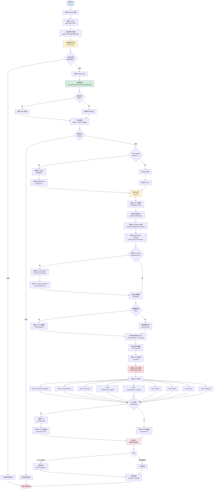
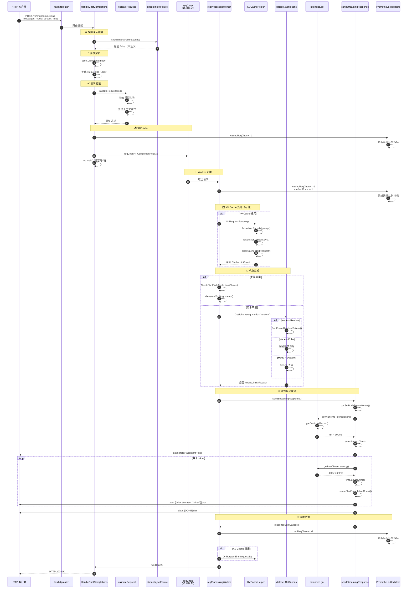
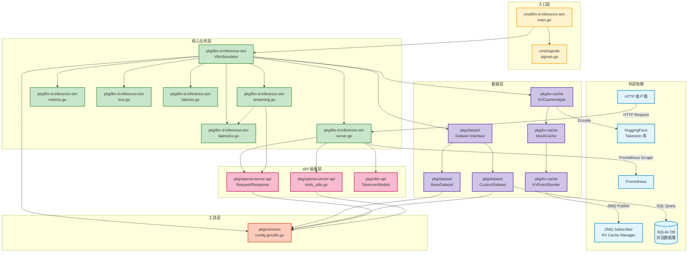

# 项目架构文档

## 文档概览

本文档提供 **llm-d-inference-sim** 项目的完整架构视图，包括系统设计、模块划分、数据流向、外部依赖和配置管理。

**项目定位**：vLLM HTTP 端点模拟器，**不执行真实推理**，用于测试、开发和性能基准测试。

---

## 一、系统整体架构

### 1.1 架构设计原则

1. **模拟优先**：模拟延迟而非执行真实推理，支持可配置的 TTFT 和 Inter-Token Latency
2. **高性能**：基于 fasthttp 构建，支持高并发请求处理（Worker Pool 模式）
3. **可观测性**：集成 Prometheus 指标，支持 Kubernetes 健康检查
4. **可扩展性**：支持 Data Parallel 部署（1-8 Rank）、LoRA 适配器动态加载
5. **兼容性**：完全兼容 OpenAI API 和 vLLM API 规范

### 1.2 系统分层架构

```
┌─────────────────────────────────────────────────────────────────┐
│                        客户端层                                  │
│  - HTTP 客户端（OpenAI SDK、Curl、Postman 等）                  │
│  - Prometheus（指标采集）                                        │
│  - KV Cache Manager（外部服务，通过 ZMQ 订阅）                  │
└────────────────────────────┬────────────────────────────────────┘
                             │ HTTP/ZMQ
┌────────────────────────────▼────────────────────────────────────┐
│                        接入层（HTTP Server）                     │
│  - fasthttp Server（高性能 HTTP 框架）                           │
│  - fasthttprouter（路由器）                                      │
│  - 9 个 HTTP 端点（Chat/Text Completion、Models、LoRA 等）      │
└────────────────────────────┬────────────────────────────────────┘
                             │
┌────────────────────────────▼────────────────────────────────────┐
│                        业务逻辑层                                │
│  ┌──────────────────────────────────────────────────────────┐  │
│  │ 请求处理流程                                              │  │
│  │  1. 请求解析与验证（JSON Schema 验证）                    │  │
│  │  2. 故障注入检查（可选）                                  │  │
│  │  3. 请求入队（reqChan，容量 1000）                        │  │
│  │  4. Worker Pool 处理（MaxNumSeqs 个 goroutine）          │  │
│  │  5. 响应生成（工具调用/文本）                             │  │
│  │  6. 延迟模拟（TTFT + Inter-Token Latency）                │  │
│  │  7. 响应发送（流式 SSE / 非流式 JSON）                    │  │
│  └──────────────────────────────────────────────────────────┘  │
│                                                                  │
│  ┌──────────────────────────────────────────────────────────┐  │
│  │ 核心组件                                                  │  │
│  │  - VllmSimulator（核心模拟器）                            │  │
│  │  - LoRA 管理器（sync.Map，线程安全）                      │  │
│  │  - KV Cache 辅助器（可选）                                │  │
│  │  - Dataset（随机/Echo/SQLite）                            │  │
│  │  - Tokenizer（HuggingFace）                               │  │
│  └──────────────────────────────────────────────────────────┘  │
└────────────────────────────┬────────────────────────────────────┘
                             │
┌────────────────────────────▼────────────────────────────────────┐
│                        数据与存储层                              │
│  - SQLite（对话数据集，可选）                                    │
│  - 内存缓存（LoRA 适配器、KV Cache 块、LRU）                     │
│  - Prometheus Registry（指标存储）                               │
└────────────────────────────┬────────────────────────────────────┘
                             │
┌────────────────────────────▼────────────────────────────────────┐
│                        外部接口层                                │
│  - ZMQ Publisher（KV Cache 事件发布到外部 Manager）             │
│  - Prometheus Exporter（/metrics 端点）                          │
│  - Kubernetes Probes（/health、/ready）                          │
└─────────────────────────────────────────────────────────────────┘
```

### 1.3 核心设计模式

| 设计模式 | 应用场景 | 代码位置 |
|---------|---------|---------|
| **生产者-消费者** | HTTP Handler（生产者）→ reqChan → Worker Pool（消费者） | `simulator.go:313-317` |
| **观察者模式** | 业务逻辑 → Channel → Prometheus 指标更新器 | `metrics.go:196-261` |
| **策略模式** | Dataset 接口（BaseDataset / CustomDataset） | `dataset/dataset.go:72` |
| **工厂模式** | `vllmsim.New()` 创建模拟器实例 | `simulator.go:124` |
| **适配器模式** | `CompletionRequest` 接口统一 Chat 和 Text 请求 | `openai-server-api/request.go:33` |
| **单例模式** | 信号处理器（`onlyOneSignalHandler`） | `signals/signals.go:26` |

---

## 二、顶层目录结构

### 2.1 目录树

```
llm-d-inference-sim/
├── cmd/                      # 程序入口
│   ├── llm-d-inference-sim/  # 主程序
│   └── signals/              # 信号处理
├── pkg/                      # 核心包
│   ├── llm-d-inference-sim/  # 核心模拟器
│   ├── openai-server-api/    # OpenAI API 结构
│   ├── vllm-api/             # vLLM API 结构
│   ├── dataset/              # 数据集管理
│   ├── kv-cache/             # KV Cache 模拟
│   └── common/               # 通用工具
├── manifests/                # 配置文件示例
├── helm/                     # Helm Chart
├── hooks/                    # Git Hooks
├── docs/                     # 文档
├── Makefile                  # 构建工具
├── Dockerfile                # 容器镜像
├── go.mod / go.sum           # Go 依赖管理
└── README.md                 # 项目说明
```

### 2.2 目录详细说明表

| 目录 | 作用 | 关键文件 | 说明 |
|-----|------|---------|------|
| **`cmd/llm-d-inference-sim/`** | 程序入口，初始化日志、信号处理、启动模拟器 | `main.go` | 调用 `vllmsim.New()` 和 `vllmSim.Start()` |
| **`cmd/signals/`** | 信号处理，优雅关闭 | `signals.go` | 监听 SIGTERM/SIGINT，触发 Context 取消 |
| **`pkg/llm-d-inference-sim/`** | 核心模拟器实现 | `server.go`（HTTP 路由）<br/>`simulator.go`（请求处理）<br/>`streaming.go`（SSE 流式）<br/>`latencies.go`（延迟模拟）<br/>`lora.go`（LoRA 管理）<br/>`metrics.go`（Prometheus）<br/>`failures.go`（故障注入）<br/>`server_tls.go`（TLS 配置） | 包含所有 HTTP Handler 和业务逻辑 |
| **`pkg/openai-server-api/`** | OpenAI API 请求/响应结构 | `request.go`（请求结构）<br/>`response.go`（响应结构）<br/>`tools_utils.go`（工具验证和生成） | 定义 `ChatCompletionRequest`、`TextCompletionRequest` 等 |
| **`pkg/vllm-api/`** | vLLM 专用 API 结构 | `tokenize.go`（分词请求/响应）<br/>`vllm-models.go`（模型列表） | 定义 `TokenizeRequest`、`ModelsResponse` 等 |
| **`pkg/dataset/`** | 数据集管理（随机/Echo/SQLite） | `dataset.go`（接口定义）<br/>`base_dataset.go`（随机预设）<br/>`custom_dataset.go`（SQLite 数据集） | 支持三种响应生成模式 |
| **`pkg/kv-cache/`** | KV Cache 模拟和 ZMQ 事件发布 | `kv_cache.go`（主逻辑）<br/>`block_cache.go`（块缓存）<br/>`kv_cache_sender.go`（ZMQ 发送） | 模拟 KV Cache 分配、命中率计算 |
| **`pkg/common/`** | 通用工具和配置解析 | `config.go`（配置结构和解析）<br/>`utils.go`（工具函数） | 包含随机数生成、分词、配置验证 |
| **`manifests/`** | Kubernetes 配置文件示例 | `config.yaml`（配置示例）<br/>`deployment.yaml`（部署示例） | 提供 YAML 配置模板 |
| **`helm/`** | Helm Chart 部署文件 | `llm-d-inference-sim/`（Chart 目录） | 用于 Kubernetes 部署 |
| **`hooks/`** | Git Hooks 脚本 | `pre-commit`（提交前检查） | 代码质量检查 |
| **`docs/`** | 项目文档 | `README.md`<br/>`architecture.md` | 使用说明和架构文档 |

---

## 三、启动流程图

### 3.1 完整启动流程（Mermaid）



### 3.2 启动阶段说明

| 阶段 | 步骤 | 耗时预估 | 关键操作 |
|-----|------|---------|---------|
| **初始化阶段** | 1-5 | < 10ms | 创建日志器、Context、信号处理器、模拟器实例 |
| **配置阶段** | 6-10 | < 50ms | 解析 YAML/命令行、验证配置、创建 Data Parallel Rank |
| **组件初始化** | 11-18 | 100-500ms | 加载 LoRA、创建 Tokenizer（需下载模型）、初始化 KV Cache、加载 SQLite 数据集 |
| **服务启动** | 19-28 | < 50ms | 启动 Worker Pool、指标更新器、HTTP 路由注册 |
| **运行阶段** | 29 | 持续运行 | 监听端口，处理请求 |
| **关闭阶段** | 30-32 | < 5s | 优雅关闭，清理资源 |

---

## 四、核心调用链时序图

### 4.1 Chat Completion 请求完整时序图



### 4.2 关键路径说明

| 步骤 | 操作 | 耗时（预估） | 说明 |
|-----|------|------------|------|
| 1-2 | HTTP 路由匹配 | < 1ms | fasthttp 路由器 |
| 3-4 | 故障注入检查 | < 1ms | 随机数判断 |
| 5-6 | JSON 解析 | 1-5ms | 取决于请求体大小 |
| 7-9 | 请求验证 | < 1ms | 内存查找 |
| 10-12 | 请求入队 | < 1ms | Channel 发送（可能阻塞） |
| 13-15 | Worker 取出请求 | < 1ms | Channel 接收 |
| 16-20 | KV Cache 处理 | 10-50ms | Tokenizer 编码 + 块查找 |
| 21-27 | 响应生成 | 5-100ms | 取决于模式（Random < Echo < Dataset） |
| 28-35 | 延迟模拟 | **TTFT + n * InterTokenLatency** | **主要耗时部分** |
| 36-38 | 流式发送 | 1-5ms | 网络传输 |
| 39-42 | 清理资源 | < 1ms | Channel 发送 |

**总耗时** = `TTFT + (n_tokens - 1) * InterTokenLatency + 其他开销（约 50-200ms）`

---

## 五、模块依赖关系图

### 5.1 完整依赖图（Mermaid）



### 5.2 依赖层次说明

```
层级 0（外部依赖）
  ├─ fasthttp（HTTP 框架）
  ├─ prometheus/client_golang（指标）
  ├─ pebbe/zmq4（ZeroMQ，CGO）
  ├─ mattn/go-sqlite3（SQLite，CGO）
  ├─ daulet/tokenizers（HuggingFace Tokenizer，CGO）
  └─ llm-d-kv-cache-manager（外部 Go 库）

层级 1（入口层）
  ├─ cmd/llm-d-inference-sim
  └─ cmd/signals

层级 2（核心业务层）
  └─ pkg/llm-d-inference-sim
      ├─ 依赖：层级 3（API 抽象层）
      ├─ 依赖：层级 4（数据层）
      └─ 依赖：层级 5（工具层）

层级 3（API 抽象层）
  ├─ pkg/openai-server-api
  └─ pkg/vllm-api
      └─ 依赖：pkg/openai-server-api

层级 4（数据层）
  ├─ pkg/dataset
  └─ pkg/kv-cache

层级 5（工具层）
  └─ pkg/common（无内部依赖）
```

---

## 六、外部依赖

### 6.1 数据库

#### SQLite（可选）

- **用途**：存储对话数据集，用于 Dataset 模式下的响应生成
- **表结构**：
  ```sql
  CREATE TABLE llmd (
      id INTEGER PRIMARY KEY,
      prompt_hash BLOB,           -- 对话哈希（SHA256）
      gen_tokens JSON,            -- 生成的 token 数组
      n_gen_tokens INTEGER        -- token 数量
  );
  CREATE INDEX idx_prompt_hash ON llmd(prompt_hash);
  ```
- **访问方式**：`database/sql` + `mattn/go-sqlite3`（CGO）
- **配置项**：
  - `--dataset-path`：本地数据库路径
  - `--dataset-url`：下载 URL（如果文件不存在）
  - `--dataset-in-memory`：是否加载到内存（提高性能）
- **代码位置**：`pkg/dataset/custom_dataset.go`

---

### 6.2 消息队列

#### ZeroMQ（可选）

- **用途**：发布 KV Cache 事件到外部 KV Cache Manager
- **模式**：PUB-SUB（模拟器作为 Publisher）
- **消息格式**：MessagePack 序列化
- **事件类型**：
  - `allocate`：分配 KV Cache 块
  - `deallocate`：释放 KV Cache 块
  - `hit`：Cache 命中
  - `miss`：Cache 未命中
- **配置项**：
  - `--enable-kvcache`：启用 KV Cache 功能
  - `--zmq-endpoint`：ZMQ 端点（默认 `tcp://localhost:5557`）
  - `--zmq-max-connect-attempts`：最大重试次数
  - `--event-batch-size`：批量发送大小（默认 16）
- **代码位置**：`pkg/kv-cache/kv_cache_sender.go`

---

### 6.3 缓存

#### 内存缓存（LRU）

- **用途**：KV Cache 块缓存
- **实现**：`sync.Map` + 时间戳
- **淘汰策略**：LRU（Least Recently Used）
- **配置项**：
  - `--kv-cache-size`：最大块数（默认 1024）
  - `--block-size`：块大小（8/16/32/64/128，默认 16）
- **代码位置**：`pkg/kv-cache/block_cache.go:35`

#### LoRA 适配器缓存

- **用途**：存储已加载的 LoRA 适配器
- **实现**：`sync.Map`（线程安全）
- **操作**：
  - `loraAdaptors.Store(name, "")`：加载 LoRA
  - `loraAdaptors.Delete(name)`：卸载 LoRA
- **配置项**：
  - `--max-loras`：最大 LoRA 数量
  - `--max-cpu-loras`：最大 CPU LoRA 数量
- **代码位置**：`pkg/llm-d-inference-sim/simulator.go:78`

---

### 6.4 第三方 API

#### HuggingFace Tokenizer（CGO）

- **用途**：对输入文本进行分词，用于 KV Cache 和 `/tokenize` 端点
- **实现**：`daulet/tokenizers` 包（封装 Rust 库）
- **依赖**：`libtokenizers.a`（静态库，需下载）
- **下载方式**：`make download-tokenizer`
- **配置项**：
  - `--tokenizers-cache-dir`：Tokenizer 缓存目录
- **代码位置**：`pkg/kv-cache/kv_cache.go:73`

---

### 6.5 监控与可观测性

#### Prometheus

- **用途**：指标采集
- **端点**：`GET /metrics`
- **指标列表**：
  ```
  vllm:lora_requests_info          # LoRA 请求信息
  vllm:num_requests_running        # 运行中的请求数
  vllm:num_requests_waiting        # 等待队列中的请求数
  vllm:gpu_cache_usage_perc        # KV Cache 使用率（0-1）
  ```
- **更新机制**：异步 Channel 更新（4 个 goroutine）
- **代码位置**：`pkg/llm-d-inference-sim/metrics.go`

#### Kubernetes Probes

- **健康检查**：`GET /health` → 返回 `{}`（200 OK）
- **就绪检查**：`GET /ready` → 返回 `{}`（200 OK）
- **代码位置**：`pkg/llm-d-inference-sim/server.go:313-326`

---

## 七、配置项

### 7.1 配置方式

支持三种配置方式（优先级从高到低）：

1. **命令行标志**（`--flag value`）
2. **YAML 配置文件**（`--config config.yaml`）
3. **环境变量**（`POD_NAME`、`POD_NAMESPACE`、`PYTHONHASHSEED`）

### 7.2 核心配置项分类

#### 7.2.1 服务器配置

| 参数 | 类型 | 默认值 | 说明 |
|-----|------|--------|------|
| `--port` | int | 8000 | HTTP/HTTPS 监听端口 |
| `--model` | string | **必填** | 基础模型名称 |
| `--served-model-name` | []string | `[model]` | API 暴露的模型别名（支持多个） |
| `--data-parallel-size` | int | 1 | Data Parallel Rank 数量（1-8） |

#### 7.2.2 性能配置

| 参数 | 类型 | 默认值 | 说明 |
|-----|------|--------|------|
| `--max-num-seqs` | int | 5 | 最大并发请求数（Worker Pool 大小） |
| `--max-model-len` | int | 1024 | 模型上下文窗口大小 |
| `--max-loras` | int | 1 | 最大 LoRA 数量 |
| `--max-cpu-loras` | int | `max-loras` | 最大 CPU LoRA 数量 |

#### 7.2.3 延迟配置

| 参数 | 类型 | 默认值 | 说明 |
|-----|------|--------|------|
| `--time-to-first-token` | int | 0 | 首 token 延迟（毫秒） |
| `--time-to-first-token-std-dev` | int | 0 | 首 token 延迟标准差（最多 30%） |
| `--inter-token-latency` | int | 0 | token 间延迟（毫秒） |
| `--inter-token-latency-std-dev` | int | 0 | token 间延迟标准差（最多 30%） |
| `--prefill-overhead` | int | 0 | 预填充开销（毫秒） |
| `--prefill-time-per-token` | int | 0 | 预填充每 token 时间（毫秒） |
| `--prefill-time-std-dev` | int | 0 | 预填充时间标准差 |
| `--kv-cache-transfer-latency` | int | 0 | KV Cache 传输延迟（毫秒） |
| `--kv-cache-transfer-time-per-token` | int | 0 | KV Cache 传输每 token 时间 |
| `--time-factor-under-load` | float64 | 1.0 | 负载因子（≥1.0，随并发数增加） |

#### 7.2.4 响应模式配置

| 参数 | 类型 | 默认值 | 说明 |
|-----|------|--------|------|
| `--mode` | string | `random` | 响应生成模式（`echo` / `random`） |
| `--seed` | int64 | 当前时间戳 | 随机种子 |
| `--dataset-path` | string | - | SQLite 数据集本地路径 |
| `--dataset-url` | string | - | SQLite 数据集下载 URL |
| `--dataset-in-memory` | bool | false | 是否加载到内存 |

#### 7.2.5 KV Cache 配置

| 参数 | 类型 | 默认值 | 说明 |
|-----|------|--------|------|
| `--enable-kvcache` | bool | false | 启用 KV Cache 功能 |
| `--kv-cache-size` | int | 1024 | KV Cache 最大块数 |
| `--block-size` | int | 16 | Token 块大小（8/16/32/64/128） |
| `--tokenizers-cache-dir` | string | - | Tokenizer 缓存目录 |
| `--hash-seed` | string | `PYTHONHASHSEED` | 哈希种子 |
| `--zmq-endpoint` | string | `tcp://localhost:5557` | ZMQ 端点地址 |
| `--zmq-max-connect-attempts` | uint | 0 | ZMQ 最大重试次数（≤10） |
| `--event-batch-size` | int | 16 | 事件批量发送大小 |

#### 7.2.6 故障注入配置

| 参数 | 类型 | 默认值 | 说明 |
|-----|------|--------|------|
| `--failure-injection-rate` | int | 0 | 故障注入率（0-100） |
| `--failure-types` | []string | - | 故障类型列表（`rate_limit`/`invalid_api_key`/`context_length`/`server_error`/`invalid_request`/`model_not_found`） |

#### 7.2.7 TLS 配置

| 参数 | 类型 | 默认值 | 说明 |
|-----|------|--------|------|
| `--ssl-certfile` | string | - | TLS 证书文件路径 |
| `--ssl-keyfile` | string | - | TLS 私钥文件路径 |
| `--self-signed-certs` | bool | false | 自动生成自签名证书 |

#### 7.2.8 工具调用配置

| 参数 | 类型 | 默认值 | 说明 |
|-----|------|--------|------|
| `--max-tool-call-integer-param` | int | 100 | 工具调用整数参数最大值 |
| `--min-tool-call-integer-param` | int | 0 | 工具调用整数参数最小值 |
| `--max-tool-call-number-param` | float64 | 100.0 | 工具调用浮点参数最大值 |
| `--min-tool-call-number-param` | float64 | 0.0 | 工具调用浮点参数最小值 |
| `--max-tool-call-array-param-length` | int | 5 | 工具调用数组参数最大长度 |
| `--min-tool-call-array-param-length` | int | 1 | 工具调用数组参数最小长度 |
| `--tool-call-not-required-param-probability` | int | 50 | 添加非必需参数的概率（0-100） |
| `--object-tool-call-not-required-field-probability` | int | 50 | 添加非必需对象字段的概率（0-100） |

#### 7.2.9 LoRA 配置

| 参数 | 类型 | 默认值 | 说明 |
|-----|------|--------|------|
| `--lora-modules` | []string | - | LoRA 模块列表（JSON 字符串数组） |

**示例**：
```bash
--lora-modules '{"name":"my-lora","path":"/path/to/lora","base_model_name":"Qwen/Qwen2.5-1.5B-Instruct"}'
```

#### 7.2.10 测试配置

| 参数 | 类型 | 默认值 | 说明 |
|-----|------|--------|------|
| `--fake-metrics` | string | - | 假指标（JSON 字符串，用于测试） |

---

### 7.3 配置文件示例

```yaml
# manifests/config.yaml

# 服务器配置
port: 8000
model: "Qwen/Qwen2.5-1.5B-Instruct"
served-model-name:
  - "Qwen/Qwen2.5-1.5B-Instruct"
  - "qwen-1.5b"

# 性能配置
max-num-seqs: 10
max-model-len: 2048
max-loras: 5

# 延迟配置
time-to-first-token: 100
time-to-first-token-std-dev: 10
inter-token-latency: 20
inter-token-latency-std-dev: 2
time-factor-under-load: 1.5

# 响应模式
mode: random
seed: 12345

# KV Cache 配置
enable-kvcache: true
kv-cache-size: 2048
block-size: 16
zmq-endpoint: "tcp://localhost:5557"
event-batch-size: 32

# 数据集配置
dataset-path: "/data/conversations.sqlite3"
dataset-url: "https://huggingface.co/datasets/hf07397/inference-sim-datasets/resolve/main/conversations.sqlite3"
dataset-in-memory: true

# 故障注入
failure-injection-rate: 5
failure-types:
  - "rate_limit"
  - "server_error"

# Data Parallel
data-parallel-size: 4

# LoRA 模块
lora-modules:
  - name: "math-lora"
    path: "/models/loras/math"
    base_model_name: "Qwen/Qwen2.5-1.5B-Instruct"
```

---

## 八、系统特性

### 8.1 高可用性特性

| 特性 | 实现方式 | 说明 |
|-----|---------|------|
| **优雅关闭** | Context 取消 + server.Shutdown() | 监听 SIGTERM/SIGINT，等待现有请求完成 |
| **健康检查** | `/health` 和 `/ready` 端点 | Kubernetes Liveness/Readiness Probes |
| **错误重试** | ZMQ 重连机制 | `--zmq-max-connect-attempts` 配置重试次数 |
| **数据库锁处理** | SQLite 锁检测 | 数据库被锁定时自动降级为随机模式 |

### 8.2 性能优化特性

| 特性 | 实现方式 | 说明 |
|-----|---------|------|
| **Worker Pool** | 固定数量 goroutine | 避免无限制创建，限制并发数 |
| **异步指标更新** | Channel + goroutine | 解耦业务逻辑和指标收集 |
| **LRU 缓存** | 时间戳 + Map | KV Cache 块自动淘汰 |
| **批量发送** | 事件队列 + 定时器 | ZMQ 事件批量发送（减少网络开销） |
| **内存数据集** | `--dataset-in-memory` | 避免频繁磁盘 I/O |

### 8.3 可观测性特性

| 特性 | 实现方式 | 说明 |
|-----|---------|------|
| **结构化日志** | klog/v2 | 支持日志级别、字段化输出 |
| **Prometheus 指标** | 4 个核心指标 | 运行/等待请求、LoRA 状态、KV Cache 使用率 |
| **请求追踪** | RequestID（UUID） | 每个请求唯一标识 |
| **Pod 标识** | HTTP Header 注入 | `x-inference-pod`、`x-inference-namespace` |

### 8.4 扩展性特性

| 特性 | 实现方式 | 说明 |
|-----|---------|------|
| **Data Parallel** | 多端口启动 | 支持 1-8 个 Rank，端口递增 |
| **LoRA 动态加载** | `/v1/load_lora_adapter` API | 运行时加载/卸载 LoRA |
| **多模型别名** | `--served-model-name` | 一个基础模型支持多个别名 |
| **插件化数据集** | Dataset 接口 | 支持自定义数据集实现 |

---

## 九、部署架构

### 9.1 单机部署

```
┌─────────────────────────────────────┐
│         llm-d-inference-sim         │
│                                     │
│  ┌─────────────────────────────┐   │
│  │   HTTP Server (Port 8000)   │   │
│  │  - Chat Completion API      │   │
│  │  - Text Completion API      │   │
│  │  - Models API               │   │
│  │  - LoRA API                 │   │
│  │  - Tokenize API             │   │
│  │  - Metrics (/metrics)       │   │
│  │  - Health (/health, /ready) │   │
│  └─────────────────────────────┘   │
│                                     │
│  ┌─────────────────────────────┐   │
│  │     Worker Pool (5 个)      │   │
│  │  - Worker 1                 │   │
│  │  - Worker 2                 │   │
│  │  - Worker 3                 │   │
│  │  - Worker 4                 │   │
│  │  - Worker 5                 │   │
│  └─────────────────────────────┘   │
│                                     │
│  ┌─────────────────────────────┐   │
│  │   SQLite DB (可选)          │   │
│  │  - conversations.sqlite3    │   │
│  └─────────────────────────────┘   │
└─────────────────────────────────────┘
```

### 9.2 Data Parallel 部署

```
┌──────────────────────────────────────────────────────┐
│              llm-d-inference-sim                     │
│                                                      │
│  Rank 0 (Port 8000)  Rank 1 (Port 8001)  ...        │
│  ┌──────────────┐    ┌──────────────┐               │
│  │ HTTP Server  │    │ HTTP Server  │               │
│  │ Worker Pool  │    │ Worker Pool  │               │
│  │ KV Cache     │    │ KV Cache     │               │
│  └──────────────┘    └──────────────┘               │
│         │                    │                       │
│         └────────┬───────────┘                       │
│                  │                                   │
│         ┌────────▼──────────┐                        │
│         │   共享 SQLite DB   │                        │
│         └───────────────────┘                        │
└──────────────────────────────────────────────────────┘
```

### 9.3 Kubernetes 部署

```yaml
apiVersion: apps/v1
kind: Deployment
metadata:
  name: llm-d-inference-sim
spec:
  replicas: 3
  template:
    spec:
      containers:
      - name: simulator
        image: ghcr.io/llm-d/llm-d-inference-sim:latest
        ports:
        - containerPort: 8000
        env:
        - name: POD_NAME
          valueFrom:
            fieldRef:
              fieldPath: metadata.name
        - name: POD_NAMESPACE
          valueFrom:
            fieldRef:
              fieldPath: metadata.namespace
        livenessProbe:
          httpGet:
            path: /health
            port: 8000
          initialDelaySeconds: 10
          periodSeconds: 30
        readinessProbe:
          httpGet:
            path: /ready
            port: 8000
          initialDelaySeconds: 5
          periodSeconds: 10
```

---

## 十、架构演进建议

### 10.1 当前架构优势

1. ✅ **高性能**：基于 fasthttp，支持高并发
2. ✅ **可扩展**：Data Parallel、LoRA 动态加载
3. ✅ **可观测**：Prometheus 指标、结构化日志
4. ✅ **易测试**：故障注入、假指标支持
5. ✅ **易部署**：Docker、Helm、Kubernetes 支持

### 10.2 潜在改进方向

1. 🔄 **中间件系统**：实现标准的 HTTP 中间件链（CORS、认证、限流）
2. 🔄 **配置热更新**：支持运行时修改延迟参数（无需重启）
3. 🔄 **分布式追踪**：集成 OpenTelemetry（Trace、Span）
4. 🔄 **多数据集支持**：支持多个 SQLite 数据库（按模型名路由）
5. 🔄 **Redis 缓存**：KV Cache 支持 Redis 后端（分布式缓存）
6. 🔄 **gRPC 支持**：除 HTTP 外提供 gRPC 接口
7. 🔄 **插件系统**：支持动态加载响应生成插件

---

## 十一、总结

**llm-d-inference-sim** 采用模块化、分层的架构设计，通过以下技术实现高性能模拟：

1. **fasthttp + Worker Pool**：处理高并发请求
2. **Channel 异步解耦**：指标更新、KV Cache 事件发布
3. **LRU 缓存**：KV Cache 块自动淘汰
4. **延迟模拟**：可配置的 TTFT、Inter-Token Latency、负载因子
5. **多模式响应**：Echo、Random、Dataset 三种模式
6. **故障注入**：支持 6 种故障类型，用于测试

整个系统围绕 **VllmSimulator** 核心模拟器构建，通过清晰的模块依赖关系和数据流向，实现了易维护、易扩展的架构。

---

## 附录：关键代码位置速查表

| 功能 | 文件路径 | 核心函数 |
|-----|---------|---------|
| 程序入口 | `cmd/llm-d-inference-sim/main.go` | `main()` |
| HTTP 路由 | `pkg/llm-d-inference-sim/server.go` | `startServer()` |
| 请求处理 | `pkg/llm-d-inference-sim/simulator.go` | `handleCompletions()`, `reqProcessingWorker()` |
| 流式响应 | `pkg/llm-d-inference-sim/streaming.go` | `sendStreamingResponse()` |
| 延迟模拟 | `pkg/llm-d-inference-sim/latencies.go` | `getWaitTimeToFirstToken()`, `getInterTokenLatency()` |
| 指标收集 | `pkg/llm-d-inference-sim/metrics.go` | `startMetricsUpdaters()` |
| KV Cache | `pkg/kv-cache/kv_cache.go` | `OnRequestStart()`, `OnRequestEnd()` |
| 数据集 | `pkg/dataset/custom_dataset.go` | `GetTokens()` |
| 配置解析 | `pkg/common/config.go` | `ParseCommandParamsAndLoadConfig()` |
| 工具调用 | `pkg/openai-server-api/tools_utils.go` | `CreateToolCalls()`, `GenerateToolArguments()` |
